# 有机太阳能电池反偏电流上翘的物理机制

2026年10月2日

## 研究专著 2026年10月2日

### 有机太阳能电池反偏电流上翘的物理机制

从局域陷阱与完整产生循环，到场致转移、量子振动、接触供给和热反馈

读者定位为已掌握本科量子力学、统计物理和电磁学，但未必熟悉有机半导体输运的研究者。本书回答四个相互关联的问题：反向电流中的电子从哪里来；电场怎样为持续电流供能；为什么有些模型能画出上翘却不能说明机制；低温实验究竟能约束哪些过程。

现阶段最可靠的结论是：原有限距离PF启发模型的约180 mA/cm²暗电流可以重新计算并由完整电子—空穴对源解释，粒子与端点能量账本均可闭合；但它依赖同一中心两支都获得强降垒，以及远距离过程不付出耦合衰减。这两点尚无目标材料的微观证据。单纯证明守恒，不能补上它们。

新的可逆有限图说明，量子振动能够大幅改变低温强驱动速率，却不能免费完成回填、解离和输运。明确储库谱后，原先隐藏在常数交换率中的补给限制会重新出现。因而当前主线是建立有明确电荷态、带边、谱与补给的两步场致转移模型，而不是从曲线外观宣布某个机制胜出。

本书同时保留局域SRH、局域PF四速率诊断、有限距离PF、Miller–Abrahams跳跃、Marcus与量子核、顺序WKB通道、接触、集总电热、弱区和经验支路的成绩与失败。所有计算结果均为有边界的模型证据；没有把它们称为已经拟合的器件击穿预测。

来源：当前样品暂定 D18:L8-BO 约100 nm；质量比1:1.2；ITO/PEDOT:PSS/活性层/PDINN/Ag

## 阅读路线与证据等级

### 怎样阅读这份研究

第一部分从无机与有机的电子态差别建立语言，再给出器件、符号和测量约束。第二部分把SRH拆回四个过程，推导慢支路瓶颈、经典PF势垒和详细平衡。第三部分逐项审查已经尝试的器件模型与数值结果。第四部分进入低温、量子振动及显式储库。最后汇总数值可靠性、材料参数与可检验的结论。

文中的“重算”表示2026年10月2日在恢复源码上新建的独立计算，附有源码、数据和验证；“存档”表示原FF78工程中仍可读取的计算与验证文件，本书重新读取并核对其数值，但没有把全部扫描再跑一遍。“解析”表示从给定方程推导的恒等式或上界；“探索参数”表示为了研究结构而指定的数值，不是材料测量。

图上的平滑曲线不增加证据等级。插值后的密集点不等于更多自洽解；极小守恒误差不等于极小材料预测误差；一条局部速率曲线不等于器件J–V。每幅结果图的图注都应与正文中的模型层级一起阅读。

最短阅读路线是：先读产生循环、PF电荷态、双支消融、量子核和储库谱，再读模型总表。若主要关心液氮温区，则先掌握正反速率比与端点复位，再进入低温章节，避免把“低温不消失”直接等同于某一种隧穿。

| 证据类别 | 它能回答 | 它不能独自证明 |
| --- | --- | --- |
| 解析恒等式 | 方程内部是否自洽 | 方程是否对应真实材料 |
| 数值重算与独立核验 | 所写方程是否被可靠求解 | 未知参数是否真实 |
| 同材料原始文献 | 量级及工艺依赖 | 就是当前像素的参数 |
| 本样品实验 | 实际响应及约束 | 单条曲线唯一识别机制 |

来源：全文来源索引及逐文件SHA-256随可编辑源包提供

## 第一部分 从电子态到器件

### 无机能带图为何不能原样搬过来

理想晶体中，电子受到周期势作用，能用Bloch态、能带色散和有效质量组织输运问题。波包在两次散射之间可以在动量空间被电场加速；在特定场强、平均自由程和能带条件下，热载流子、带间隧穿或碰撞电离成为合适的描述。晶体中的缺陷则在这个延展态背景上引入局域能级。

分子有机半导体仍有轨道和能量分布，但分子间耦合、构象、侧链、晶域与非晶区会改变态的空间范围。电荷可能在一个分子或有限片段上局域，并伴随周围分子的电子极化与核坐标重排。因此，“HOMO/LUMO”不是一张自动包含输运有效质量、迁移率和缺陷截面的连续能带图。

这不是说有机材料绝不具有离域态或带样输运。不同纯度、温区、堆积和时间尺度可以处于不同极限。正确的做法是先确定所研究过程使用的态与长度尺度，再决定是否能采用带输运、局域跳跃或两者结合。把本项目称为有机半导体，不能替代这一步判断。

反偏问题尤其敏感：能在原子级局部发生的快速跃迁，未必能把载流子穿过100 nm薄膜；能在晶域内移动的电子，未必跨得过给受体界面或再次填满一个缺陷。微观转移与宏观连续性必须接起来。

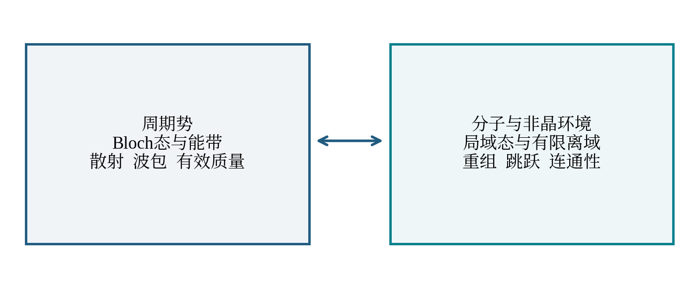

来源：理论背景 [R1] [R5] [R6]

### 晶体结的反偏增长有哪些不同途径

以晶体p–n结为例，反偏首先扩展耗尽区并增强结区电场。少数载流子漂移和耗尽区的热产生会贡献暗电流；后者即使借助缺陷，仍要完整地把价带电子转移到导带。反偏增强电流，并不从一开始就等于雪崩。

带间隧穿是强场下从被占据价带态到空导带态的量子转换，经典Zener理论提供其基本思想。陷阱辅助过程可以提供中间态，但是否弹性、是否需要声子以及末态是否可用，都要另行指定；有一条WKB指数并不说明完整产生循环已闭合。

碰撞电离则需要载流子从电场取得足够非平衡能量，再把另一电子激发为新电子—空穴对。新的载流子继续参与相同过程，才可能形成倍增或雪崩。能量获得与声子散射、动量及能带结构竞争，因此不能只用整个器件qV大于Eg就断言发生碰撞电离。

粗略的qFℓ量级有帮助，但ℓ应是对应过程的能量积累长度或真实转移跨度，绝不自动等于薄膜厚度。一个电子沿100 nm移动时可能多次耗散能量，最终电源做功qV并不意味着它在某个瞬间以qV的动能撞击别的电子。

这些机制在电荷守恒上没有例外。热产生、带间转移与碰撞倍增的电子都来自已有被占据态；所谓“产生”是相对于价带满、导带空的参考状态产生激发。相似反偏曲线背后可能是不同能量交换与反馈。

| 过程 | 直接能量问题 | 何时不能简单移植 |
| --- | --- | --- |
| 热产生 | 热浴能否完成跨隙两步 | 补给或占据已改变 |
| 带间隧穿 | 空间势垒与可用初末态 | 没有真实带边与谱 |
| 碰撞电离 | 热载流子能量分布与损失 | 电荷以局域跳跃松弛 |
| 热反馈 | 电功率与散热的动态平衡 | 把恒温模型当温升模型 |

来源：晶体经典背景：Zener 1934 DOI 10.1098/rspa.1934.0116；Shockley 1961 DOI 10.1016/0038-1101(61)90054-5；SRH [R1]

### 有机高场为何需要重新检查雪崩语言

在局域跳跃占主导的有机体系中，电子每次转移往往伴随环境重组和振动能量交换。把电场做功看成连续积累在一个自由粒子动能里的图像，就可能不适合该时间和空间尺度。极化子仍然携带电荷与能量，但它的“加速—散射”不必遵循简单晶体有效质量模型。

这不构成对有机碰撞电离的普遍否定。若某些态足够离域、能量松弛足够慢或存在特殊电子过程，需要专门的动力学证据与模型。当前项目没有电子能量分布、碰撞电离系数或明确倍增网络，因此不能把已算出的高电流叫作雪崩电流。

目前更直接的问题是：一个价态电子是否可以经缺陷分两步转到传导态，电场怎样在实际端点间供能，之后两个载流子能否分离、离开并复位中心。这些问题可以用带电荷态和核重组的可逆率图表达，再与宏观输运连接，不要求先假定一套晶体碰撞图像。

也要避免相反极端：把一切有机高场响应都叫“跳跃”同样过度。金属接触附近可以存在隧穿；局部导电缺陷可以出现强场集中；Joule热和化学变化可能改变器件。对这几种候选，最有效的是明确它们各自的电子来源、能量来源、长度和时间尺度，而不是争论一个总名称。

因此，本书用“反偏电流上翘”描述待解释现象，用“体产对”“接触供给”“局域转移”“热反馈”描述模型成分，只有满足相应定义时才使用“倍增”“失稳”或“不可逆击穿”。

来源：局域跳跃与微观声子耦合 [R5] [R6]；本项目证据边界 [D0]–[D7]

### 从光激发到自由电荷中间有哪些状态

光子吸收首先改变电子占据。若电子与空穴仍受吸引而形成中性关联激发，可用激子描述；如果它们位于相邻给体和受体上，则常用界面电荷转移态CT描述。进一步分离并进入能持续输运的态，才接近器件模型中的自由载流子。实际体系也可能有态混合和多个并行路径，不能把这些标签都理解成严格独立的单一能级。

一个直观的库仑量级是电子与空穴在介电常数εr中、距离r时的吸引能。取εr=3.5、r=1 nm，约0.411 eV，明显高于300 K的kBT≈0.0259 eV。但这个点电荷公式只提示尺度，分子电荷离域、界面极化、熵与无序都可能改变有效自由能。

暗态反偏没有持续光子供给。若模型声称在体内不断产生新电子—空穴对，就必须写出由已占据价态到可输运电子态的完整转换，说明热浴、电场或外部储库承担了哪些能量。仅把一个已有电子从陷阱释放出来，至多耗尽初始储存量，不能自动形成稳态大电流。

因此，光学隙、CT能和自由电荷端点差必须分开。后文中1.3 eV只是旧构造基准的一个参数；真实D18:L8-BO的光学与输运能量口径，需要独立证据。

$$
E_{\mathrm{C}}(r)=\frac{q^2}{4\pi\varepsilon_0\varepsilon_r r},\qquad E_{\mathrm{C}}[\mathrm{eV}]=\frac{1.43996}{\varepsilon_r r[\mathrm{nm}]}
$$

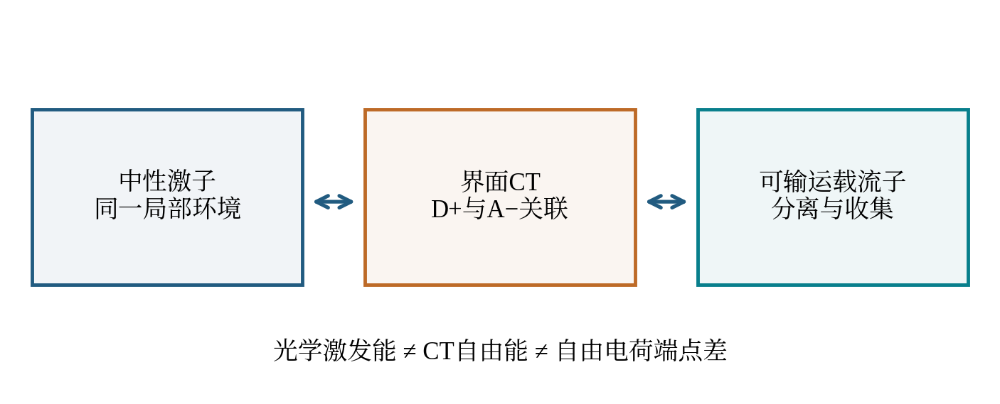

来源：材料口径 [R11] [R12]；界面CT分解 [R14]

### 极化子与无序为什么同时重要

当电荷进入一个分子，邻近电子云和核坐标会重新调整。电荷与这种形变联合组成的准粒子语言称为极化子。电子转移后环境还未调整，与充分松弛后的能量不同；二者的差异构成重组能的物理来源。后面Marcus理论中的λ描述两套核构型之间的重组代价，不能把它直接等同于库仑结合能或陷阱深度。

无序有多种来源。位点能量的分布描述能量无序；相邻分子间的重叠和距离分布影响电子耦合；晶域之间的连通性影响能否形成长程输运路径。两个具有相近吸收谱的薄膜，也可以拥有不同的迁移率和回跳概率。

“浅陷阱”和“深陷阱”必须相对于明确参考能量而言。带尾的局域态、化学缺陷、界面CT态和电极附近的电荷积累，不应只因它们让电流变慢就都压缩成同一个Nt与Et。若一个表征得到光学Urbach能，而另一个得到阻抗反演的高斯DOS宽度，它们也不自动是同一个σ。

有机输运模型常使用跳跃率、占据阻塞和空间网络。由这种模型得到的有效迁移率会依赖温度、密度和电场。反过来，从一条室温SCLC曲线得到一个μ，通常不足以唯一反推出微观H、λ和局域化长度。

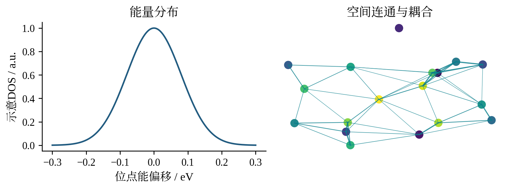

来源：有机跳跃输运与温度密度场耦合 [R5]；微观MA适用性反例 [R6]

### 当前器件信息与原始数据边界

当前讨论器件的质量比为D:A=1:1.2，层叠为ITO/PEDOT:PSS/活性层/PDINN/Ag。材料名称由用户暂定为D18:L8-BO，活性层厚度约100 nm。这里保留“暂定”和“约”，不把它们扩展为所有原始样品已经完成身份确认。

质量比不是体积分数，也不是每一相的可用态数。要转成体积比需要密度；要转成可用图密度还需要分子数、相分布、空间配对及共享态约束。类似地，知道PDINN/Ag并不自动给出目标器件的注入势垒、界面偶极或表面复合速度。

用户观察暗态与光照的上翘电压近乎相同，这是一条值得保留的定性约束，但不意味着两条电流幅值相同，也不能单独区分体产生、接触或电热机制。目前没有可用于严格检验的同像素暗亮配对，不能从模型中开关light变量，反过来制造实验配对。

原样品3曾被解释为比样品1和2提前约2 V。该解释受到电压列口径差异的实质挑战：源回读与设置电压不能混用，电流峰也不是最早上翘点。完整原始协议、时间序列与实际端压还需对应，因此本书不把“提前2 V”用作拟合目标或机制证据。

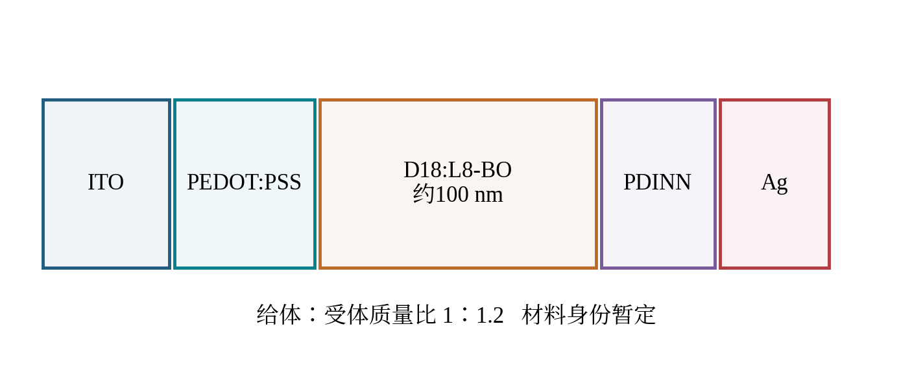

来源：样品事实来自本轮用户说明；材料约束记录 [D5]

### 上翘 阈值与击穿是三个问题

反向电流随电压增加而加速增长，可以叫作上翘或膝点，但还需要具体数学定义。一个容易复算的定义是首次达到指定电流密度J*的电压V*。本项目存档比较使用光照下|J|=50 mA/cm²的V50，同时保留V40与V75。它是比较指标，不是材料损伤的定义。

若对不同厚度拟合|V50|=K50d+b，K50只是指定阈值、厚度区间和模型下的斜率。非零截距、局部场不均匀、接触压降、光吸收和形貌变化都会影响它。即使R²很高，也不等于发现了一条普适击穿场定律。

电热失稳是温度反馈导致某稳态失去稳定性；不可逆击穿则涉及损伤、导电通道、化学变化或结构重排等不可逆过程。恒温、无损伤变量的稳态模型，即使算到安培每平方厘米，也不能直接输出不可逆击穿电压。数值迭代失败同样不是物理失稳证据。

下面的温度导数式仅适用于固定|J|阈值、可微且∂F ln|J|非零的单一分支。在非单调曲线中，一个阈值可能被穿越多次。必须规定“从零向反偏的第一次”还是别的规则，并保留全部交叉。如果扫描范围内未跨越，应留空；不能把扫描终点、峰位或求解失败电压补成阈值。

$$
|J(V_{50})|=50\ \mathrm{mA\,cm^{-2}},\qquad |V_{50}|=K_{50}d+b
$$

$$
\frac{dF^*}{dT}=-\frac{\partial_T\ln |J|}{\partial_F\ln |J|}
$$

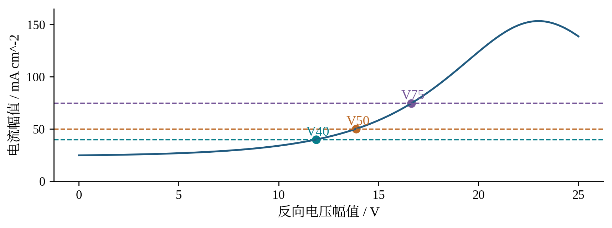

来源：指标协议 [D0]；温度阈值隐函数推导 [D3]

### 漂移扩散模型在账本中负责什么

漂移扩散不是某一种微观产生机制，而是把电荷、输运和源项组织起来的器件层描述。这里以x从空穴选择性一端指向电子选择性一端，E=−∂xφ；Jn、Jp都定义为沿+x的常规电流。电子实际运动方向与Jn相反。

Poisson方程决定电势与空间电荷之间的关系；两条连续性方程决定电子和空穴是否有未记账的来源或去向。G是产对源，R是复合，二者在电子和空穴方程中成对出现。陷阱占据变化还需要与陷阱电荷一起进入Poisson与连续性，不能只改一个反应速率而保留不匹配的占据公式。

普通局域模型中，两种载流子在同一位置产生或复合，总电流的空间导数在稳态为零。如果一次非局域事件在两个不同位置增减电荷，它本身还搬运电荷。仅计算漂移扩散电流会出现空间差异；必须把对应非局域跳跃携带的导电电流纳入总电流。这里称“位移”是指电子跳跃的空间位移，不是Maxwell的ε∂tE电流。

接触边界同样属于模型。固定浓度边界、有限交换速度边界和显式电极能谱不是同一种假设。判断电流是否来自注入，应该读取四个接触粒子通量并与体源积分对比，而不是仅凭能带画法或器件层名猜测。

$$
\frac{dE}{dx}=\frac{q}{\varepsilon}(p-n+N_{\mathrm{fixed}}+N_t z_t)
$$

$$
J_n=q\mu_n nE+qD_n\frac{dn}{dx},\quad J_p=q\mu_p pE-qD_p\frac{dp}{dx}
$$

$$
\partial_t n=\frac{1}{q}\partial_xJ_n+G-R,\quad\partial_t p=-\frac{1}{q}\partial_xJ_p+G-R
$$

来源：方程与实现 [D0] [D1]；符号和单位附录

### FF78是共同参照而非样品标定

原工程按用户要求构造了接近78%的填充因子基准。其接触势垒与平衡迁移率为构造参数；它的意义是让不同候选模型在同一参照上比较，而不是声称所有有机器件都应有这些参数。新增机制后，应报告真正计算出的FF，不能再调μ把每条曲线都拉回78%。

FF定义为最大输出功率除以VocJsc。在标准光伏曲线中它描述矩形程度。若某模型因强场复合产生反常J–V，使这个代数比值超过1，不能称为高于100%的优质FF或效率；要同时展示曲线形状，给常规指标标注不适用。

能量采用eV、电势采用V的数值式时，单位电子跨1 V等于1 eV；SI量纲式仍需显式q。本基准中Eg还同时设置本征浓度、Vbi及对称陷阱深度；Jgen则独立固定为25 mA/cm²，未由吸收谱重新积分。改Eg会联动几处电学定义，却不会自动改变光学响应。这种参数绑定适合透明的示例，但用于材料推断前必须拆开。

$$
\mathrm{FF}=\frac{P_{\max}}{V_{\mathrm{oc}}|J_{\mathrm{sc}}|},\quad n_i=N_c e^{-E_g/(2k_BT)},\quad qV_{\mathrm{bi}}=E_g-2\Phi_c
$$

| 共同量 | FF78设置 | 证据类别 |
| --- | --- | --- |
| d 与 T | 100 nm；300 K | 构造参照 |
| Eg 与 εr | 1.3 eV；3.5 | 探索假设 |
| Nc=Nv 与 Nt | 10¹⁹；10¹⁵ cm⁻³ | 探索假设 |
| μn=μp | 0.00452474 cm²/Vs | 为目标FF构造 |
| 接触势垒 | 0.05 eV | 构造边界 |
| c 与 β | 10⁻⁹；10⁻¹¹ cm³/s | 探索速率尺度 |
| Jgen | 25 mA/cm² | 规定光生尺度 |

来源：baseline_ff78.json及源代码快照 [D0]；本基准未被本书改写

### 先看所有模型再逐项拆解

下图来自原FF78存档比较，所有参数为探索设置。不同模型都可以形成相似的反向上翘，已经足以说明“形状像”不是机制鉴定方法。尤其这些模型不是同一级近似：PF和MA跳跃接入Poisson–DD；接触与WKB微结是并联有效支路；电热是集总动态方程；弱区是面积加权；经验支路只描述曲线。

原比较中，PF、MA和弱区示例都给出FF与K50的某种同向变化；接触支路较容易移动反向阈值而对FF影响很小；电热和经验支路在该厚度假设下K50接近零。这些是“这一套控制实验的模型结果”，并非真实机制得分。它们的参数轴含义不同，不能把三个点的斜率当成物理普遍性。

后文将反复区分三个判据：数学账本是否正确；数值计算是否可靠；材料是否支持关键假设。前两项通过后才能讨论第三项，但前两项本身并不能替代第三项。当前工作最有价值的进展正是把这三个问题分开。

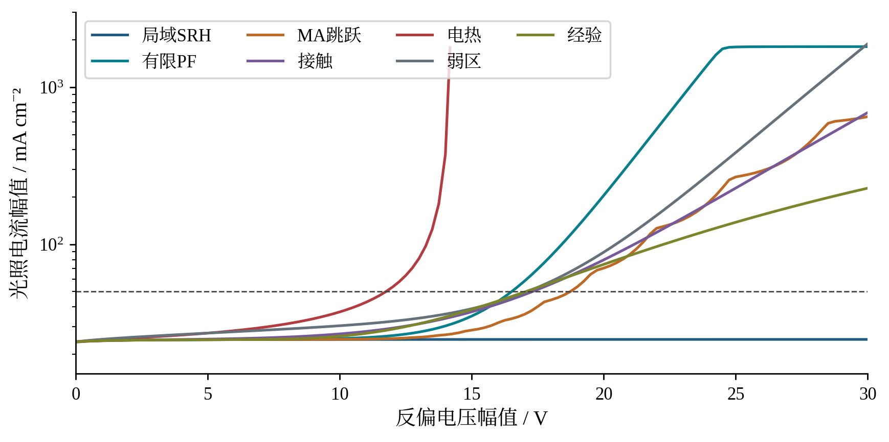

来源：原候选模型比较与CSV [D0]

## 第二部分 完整产生循环

### SRH必须拆成四个物理事件

设一个中心空态为0，电子占据态为1，电子占据概率为f。电子捕获把一个已有传导电子放入空中心；电子发射把中心电子释放到传导端点。空穴捕获是中心电子填补价态空穴；空穴发射则是一个原本占据的价态电子进入空中心，留下空穴。第四个过程是暗态持续产生循环中容易被漏掉的“回填”。

四个事件必须一起写。把电子发射加速，并不能让刚释放电子的空中心自动再次有电子；若第二次填充来自价态，就必须支付对应跨隙代价；若来自已经存在的传导或接触电子，则它构成运输通道，不能再算一对体产生。

cn、cp是浓度乘子，单位cm³/s；en、ep是单中心发射率，单位s⁻¹。四个体积事件率都要乘Nt，并包含正确的占据或空位概率。中心电子数的时间变化等于电子捕获加空穴发射，减电子发射与空穴捕获。若f非常接近1，应单独稳定计算空位概率，而不是用已舍入的1减f。

$$
r_{nc}=N_tc_n n(1-f),\quad r_{ne}=N_te_nf
$$

$$
r_{pc}=N_tc_p pf,\quad r_{pe}=N_te_p(1-f)
$$

$$
\dot f=(c_n n+e_p)(1-f)-(e_n+c_p p)f
$$

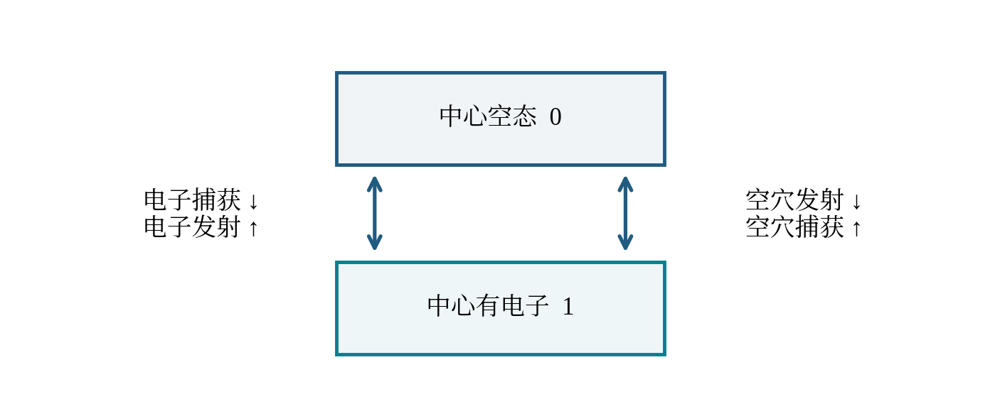

来源：SRH原始统计框架 [R1]；本项目四速率重构 [D0] [D1]

### 从占据方程推到净产生率

把所有电子端点的捕获率相加为An，空穴端点相加为Ap；电子、空穴发射总率记为En、Ep。它们都具有s⁻¹单位。稳态占据可直接由两态主方程求出，分母S是所有离开或进入占据态的总尺度。

再把f代回净电子与净空穴反应，就得到相同的每中心净对产生率。分子中的EnEp代表先形成再发射的完整产生循环，AnAp代表逆向复合循环。它不是两次发射计数相加；同一对只应计一次。若两个电极之间只发生同种电子捕获再释放，空间电荷会移动，但全器件电子净源为零。

局域热平衡要求np=ni²，同时en/cn=n1、ep/cp=p1且n1p1=ni²。于是产生与复合相抵。注意这不是要求每一种事件都消失：平衡时仍可能有很大的正反周转，只是净流为零。数值上直接从两个极大的量相减，可能把微小净流完全丢失，后面会看到这一点的真实反例。

这些式子也为模型审查提供捷径：每提出一种场增强，应先检查它怎样改变四个率、占据及正反比，再讨论J–V是否好看。

$$
S=A_n+A_p+E_n+E_p,\quad f=\frac{A_n+E_p}{S},\quad 1-f=\frac{A_p+E_n}{S}
$$

$$
R_{\mathrm{pair}}=\frac{E_nE_p-A_nA_p}{S}
$$

$$
\frac{e_n}{c_n}=n_1,\quad\frac{e_p}{c_p}=p_1,\quad n_1p_1=n_i^2
$$

| 循环 | 全器件净源 | 可能贡献空间电流 |
| --- | --- | --- |
| 价态 → 中心 → 传导态 | 一对电子空穴 | 是 |
| 传导态i → 中心 → 传导态j | 零 | 是 |
| 价态空穴i ↔ 中心 ↔ 空穴j | 零 | 是 |
| 完整产生的逆过程 | 负一对 | 是 |

来源：独立占据消元与端点循环重构 [D1]

### 为什么只把逃逸做快仍然不够

在强耗尽、俘获回流可以忽略的理想极限，完整循环率是两个等待时间之和的倒数，即两个发射率标准谐均值的一半，而不是它们的和。直观解释是同一个中心必须等待第一步，再等待第二步。无论第一步怎样加速，第二步仍然限定每秒最多能完成多少个循环。

若对称中带隙的两支起初都是e0，只把一支乘g，则完整循环相对于原e0/2最多增加两倍。这是一个严格限定的产生上界，不是“一切PF电流只能翻倍”。接触补给、多中心、额外态或改变另一支的形成物理，都是不同模型，必须重新写循环。

FF78的e0=cNc exp[−Eg/(2kBT)]在300 K约0.12036 s⁻¹。即使另一支无限快，以Nt=10¹⁵ cm⁻³、d=100 nm、完全收集换算，理想源电流也只有1.928×10⁻¹⁰ A/cm²；80 K降为1.805×10⁻⁴⁰ A/cm²。这个极小数只约束指定的纯热补给基准。

这些结果解释了为何“电子很容易逃逸”与“器件有很大持续暗电流”之间仍隔着一个问题。仅初始陷阱放空可以给瞬态电荷，却没有稳态供给；补给来自哪里必须在模型中明确。

$$
R=\frac{E_nE_p}{E_n+E_p}=\left(\frac{1}{E_n}+\frac{1}{E_p}\right)^{-1}\leq\min(E_n,E_p)
$$

$$
\frac{R(g)}{R(1)}=\frac{2g}{g+1}\leq 2,\qquad J_{\mathrm{cap}}=qN_tdR
$$

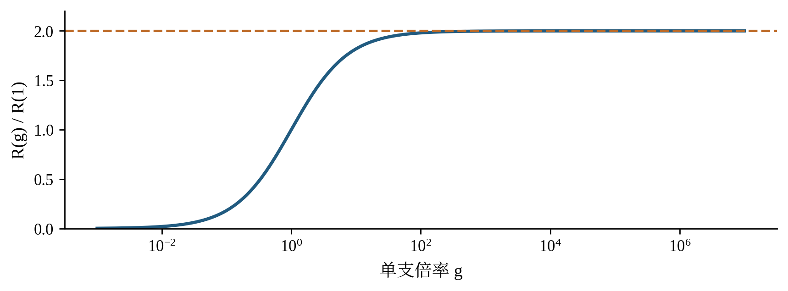

来源：解析上界与温度重算 [D1] [D3]

### 经典PF降垒从哪一个势函数来

Poole–Frenkel图像考虑载流子从吸引的带电中心附近逃逸。沿有利方向，库仑势随距离上升到零，外场线性倾斜使远处能量下降，两者叠加形成鞍点。对U(r)=−A/r−Fr，令导数为零即可得到鞍点位置与降低的势垒。

这一步有明确前提：有吸引的长程库仑尾势；可以把电荷和介质近似为连续的点电荷体系；鞍点位于核心之外；讨论的是相应方向的逃逸。三维角平均、扩散回捕获、空间电荷和接触供给并未因此自动解决。

以εr=3.5、2 MV/cm为例，rs≈1.434 nm、降垒≈0.574 eV。到3 MV/cm，rs≈1.171 nm，已经接近分子长度尺度。这提醒我们检查核心截断、局部屏蔽和电子电荷分布，而不是把根号公式无限外推。

经典PF改变的是某一逃逸路径的势垒。它不能凭名称为两种载流子各赠送一条相同的吸引势，也不能证明每次跨越5 nm仍具有同样耦合。讨论电流时，还必须回到上一页的完整循环。

$$
U(r)=-\frac{A}{r}-Fr,\quad A=\frac{1.43996}{\varepsilon_r}\ \mathrm{eV\,nm}
$$

$$
r_s=\sqrt{\frac{A}{F}},\qquad\Delta_{\mathrm{PF}}=2\sqrt{AF}
$$

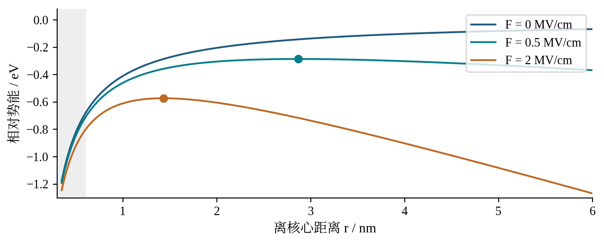

来源：吸引库仑中心与PF逃逸前提 [R2]；本报告解析尺度检查 [D3] [D5]

### 同一普通两态中心不能任意双支PF

设一个普通单电子两态中心的空态电荷为me，占据态为(m−1)e。电子发射后中心处于空态。要让逸出电子受到吸引的单极库仑尾势，残余中心必须为正，因此m>0。空穴发射则由价态电子填入中心，最终留下占据态；要吸引被留下的正空穴，这个中心必须为负，因此m−1<0。

两支同时满足上述条件，要求0<m<1。若m为普通整数电荷态，这个区间无解。donor型+/0中心自然支持电子支的吸引尾势；acceptor型0/−中心则自然支持空穴支。把二者都叫作“陷阱”，不能消除电荷态差别。

这个论证的范围应严格限制：它反对的是同一个普通整数电荷、单电子两态中心，两支都使用相同单极PF吸引势。它没有排除多电荷态、两个缺陷组成的复合体、分布式电荷或显式近态。但后者必须增加相应状态、形成能、占据和返回路径，不能只换一个名称继续使用原率。

原Poisson项Nt(0.5−f)可以表示补偿背景下的电荷约定；它并没有证明一个微观中心真实具有+0.5e和−0.5e的两种长程单极尾势。这是平均电荷记账与微观势模型之间的区别。

$$
q_{\mathrm{empty}}=me,\quad q_{\mathrm{filled}}=(m-1)e
$$

$$
\mathrm{electron\ attraction}:\ m>0,\quad\mathrm{hole\ attraction}:\ m<1
$$

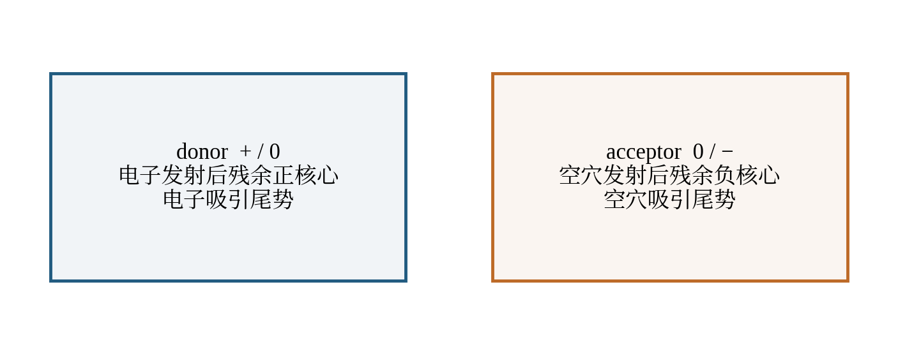

来源：原始PF电子发射的正残余中心前提 [R2]；本次电荷态代数审计 [D1]

### PF与Schottky降垒不能混称

经典PF考虑体内带电中心的库仑吸引。理想Schottky图像则考虑载流子靠近金属平面时的像电荷势。像电荷项的系数与孤立单位电荷不同，因此相同介电常数和电场下，理想PF降垒是理想Schottky降垒的两倍。下式给降垒的eV数值；若用焦耳表示势垒，右式整体再乘q。

这个二倍关系是两种理想势函数的比较，不是对任何实际有机界面的通用拟合规则。电极表面偶极、界面态、分子取向、无序、隧穿和注入后的空间电荷，都可能改变实际过程。仅在lnJ对√F图上得到一条近似直线，无法唯一鉴定是哪种过程。

体产生模型需要追踪价态到传导态的完整循环；接触注入模型则从电极储库供给已有电子，后续还要完成电流回路。二者可以产生相似端口曲线，却对电极、厚度、光照和温度的响应不同。若模型只是把一个注入支路并到原DD上，不能声称已经处理了注入电荷对场的反馈。

本项目后面同时保留PF启发体源与有效Schottky支路。它们的共同点是指数率对势垒敏感；不同点是势函数、供给端点以及与器件的耦合层级。把这些差别写清，比给相似曲线贴同一标签更有用。

$$
\Delta_{\mathrm{PF}}=\sqrt{\frac{qF}{\pi\varepsilon}},\qquad \Delta_{\mathrm{S}}=\sqrt{\frac{qF}{4\pi\varepsilon}}=\frac{1}{2}\Delta_{\mathrm{PF}}
$$

| 问题 | 体内PF逃逸 | 理想Schottky注入 |
| --- | --- | --- |
| 势的来源 | 带电中心 | 金属像电荷 |
| 供给要追踪什么 | 陷阱形成与复位 | 电极占据与界面交换 |
| 电流闭合 | 产生或输运需另判定 | 储库供给及全器件回路 |
| 直接套用的风险 | 错设核心电荷态 | 忽略界面及空间电荷 |

来源：PF前提 [R2]；有效接触支路的具体实现 [D0]

### 详细平衡约束速率比而非速率大小

给定同一温度下的初态和末态自由能，一条正向跃迁与逆向跃迁的比值受到热力学约束。若电子跨储库交换，还要包括储库电化学势与粒子数变化。ΔNα取从储库α进入所研究系统的粒子数，循环m取L→R净转移电子数为正。简并、占据阻塞和场势应进入同一个定义，不能有的藏在ΔG里，有的又在费米因子里重复计算。

一个重要但常被混淆的事实是：平衡可以存在静电场。器件内建场由扩散与漂移平衡维持；只要共同电化学势下每条边的正反通量相等，就没有持续净电流。把F≠0直接当成额外泵浦，会在零外偏器件里制造伪暗流。

同时满足详细平衡的率有无穷多组。把一对正反率共同乘以任意正数，不改变比值，却会改变动力学；因此“正反比正确”并不证明某个10¹² s⁻¹前因子、某个5 nm耦合或某个常数储库交换是真实的。后面的量子储库例子正好展示了这种区别。

对一个闭合循环，所有状态能差首尾相消。持续净循环必须由不同储库的化学势差、外部泵或另一种非平衡来源驱动。局部场功与已经计入的端点电势差不能重复加算。

$$
\Delta G_{ij}=G_j-G_i-\sum_\alpha\mu_\alpha\Delta N_\alpha
$$

$$
\frac{k_{ij}}{k_{ji}}=\exp\!\left[-\frac{\Delta G_{ij}}{k_BT}\right]
$$

$$
\mathcal{A}_{\mathrm{cycle}}=\sum_{(ij)}\ln\frac{k_{ij}}{k_{ji}}=\frac{m(\mu_L-\mu_R)}{k_BT}
$$

来源：有限场逐边平衡 [D1]；五个独立循环亲和力验证 [D4]

## 第三部分 已尝试的器件模型

### 局域四速率A到D究竟改变了什么

最直接的诊断是保持局域态和器件结构，只改变四速率的共同倍率。A不增强，回到原SRH；B把电子与空穴两对捕获/发射都乘g；C只把电子捕获和电子发射这一对乘g；D只把空穴的一对乘g。因为每一对正反率同步改变，局域平衡能级不变。

这里的g具有PF式根号场依赖，并在势垒接近消失时平滑饱和。但A到D首先是速率闭合的数学实验，并不是已经识别缺陷电荷态的微观PF理论。特别是B的捕获和复合也被极强增强，不能只把它描述成“发射更容易”。

固定局域能级、固定ni时，若只把en和ep都乘g而不改捕获，将在np=ni²的平衡状态下留下净产生，因为两个发射的乘积多了g²。这个错误说明该具体代入不自洽；它不否定所有耗尽区逃逸近似、显式近态或非局域PF模型。

C和D在对称接触、相同电子空穴迁移率下有镜像对称性，因此端口曲线接近；它们内部占据和陷阱电荷却不同。不能从端口重合推断真实器件中电子与空穴分支永远等价。

| 组别 | cn 与 en | cp 与 ep | 平衡口径 |
| --- | --- | --- | --- |
| A | 原值 | 原值 | 原SRH |
| B | 共同乘g | 共同乘g | 四系数共同增强 |
| C | 共同乘g | 原值 | 电子支诊断 |
| D | 原值 | 共同乘g | 空穴支诊断 |

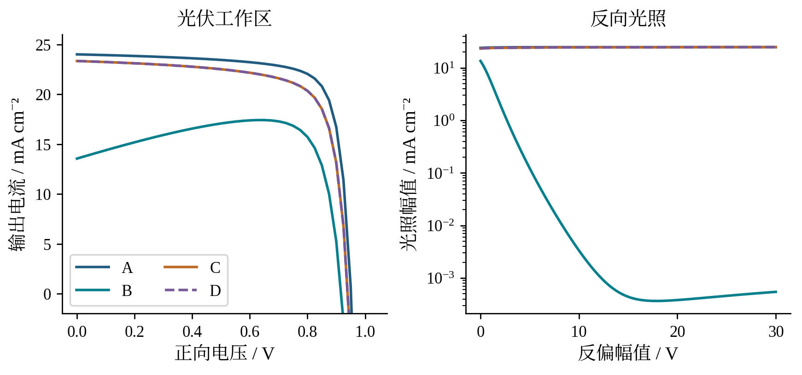

来源：通用四速率诊断与50项限定检查 [D0]

### 局域全倍率为何让光电流塌缩

B闭合使局域SRH净率整体乘g。当反偏场很大时，捕获与复合也很强，光生载流子在到达电极前就更多地消失。接近正向低场时，这种增强减弱，反而可能得到大于短路电流的工作区电流，曲线不再具有标准光伏形状。

在Nt=10¹⁵ cm⁻³、100 nm的存档结果中，B的Jsc约13.55 mA/cm²，Pmax/(VocJsc)为102.28%，但常规FF被留空。Nt=10¹⁶时该代数比值甚至达到146.30%。这是反常曲线的指标问题，不是能量转换超过100%。反向到−30 V，光照电流只有约5.46×10⁻⁴ mA/cm²，远没有原有限距离模型的上翘。

C/D只增强一个载流子率对，Jsc约23.33 mA/cm²、FF约74.18%，避免了B那么强的塌缩，却仍没有跨越V40、V50或V75。单支耗尽产生受慢支上界限制，光照下还同时存在复合与提取，不能把“两倍上界”硬套到所有端口光电流。

这轮失败给出的正确结论是：这个固定局域态、共同倍率闭合不能在当前参数下同时解释正常光伏与大反向电流。它没有证明所有局域PF都失败，也没有证明有限距离PF就具有正确微观机制。

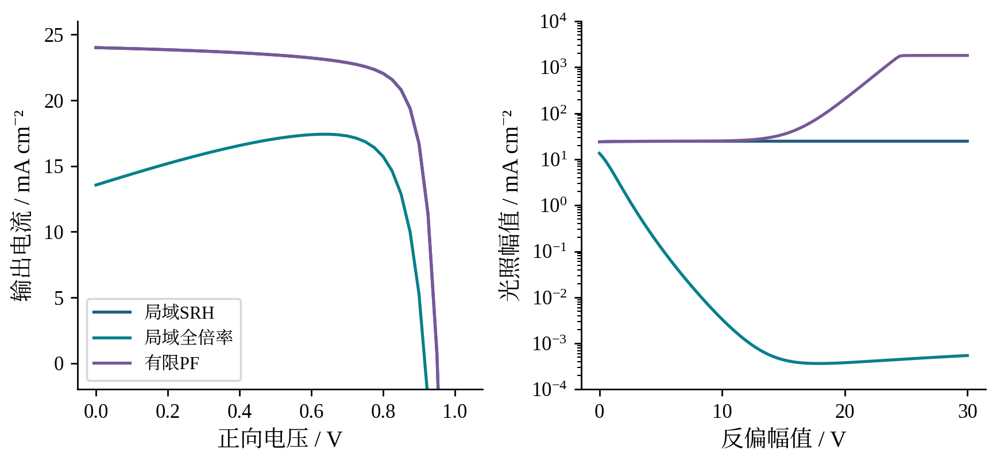

来源：局域PF报告、metrics.csv与代表网格检查 [D0]

### 有限距离PF模型的完整定义

以下复述代码采用能量eV、电势V的数值约定，电势能项的q由数值换算隐含；SI式应显式写qΔφ。原有限距离PF启发模型让中心与两侧相距ℓ的端点交换载流子。每侧默认ℓ=5 nm，因此最有利的一对电子与空穴端点可相隔10 nm。端点能量随电势差变化；过渡态必须不低于初末端点，从而生成共享势垒的捕获与发射率。

这套构造可以让每一对正反率满足端点能量详细平衡，并让电子、空穴在不同位置出现。由此带来的非局域位移电流必须另外计入，总电流不再仅是Jn+Jp。它是一个明确的假设模型，不是“把SRH乘了一个PF因子”的同义词。

实现边界也须公开：场范数实际为√[E²+(1 V/cm)²]；smoothmax(a,b)=½[a+b+√((a−b)²+w²)]。请求ℓ=0仍被强制成一格；ℓ>d且η=1时通道全消失而占据成0/0。这些是已发现的参数域缺口，不改变常用5 nm代表解的账本结论。

核心风险有两项。第一，电子与空穴都使用相同的PF基础降垒，而普通单中心双支吸引势尚未成立。第二，裸前因子cNcη/2不随5 nm跨度衰减，因此隐含了很强的空间可达性或耦合。参数η=0.5还会把捕获尺度分到局域和非局域通道，因此蓝紫曲线的差别不能全部归于长度本身。

下面的重算保留原方程以审查它到底做了什么，不先把结果删掉或改成较符合预期的形状。

$$
\Delta_n=E_g/2-[\phi_e-\phi_t],\quad\Delta_p=E_g/2+[\phi_h-\phi_t]
$$

$$
B_0=s_+(E_g/2-\Delta_{\mathrm{PF}}),\quad B=s_+(B_0,\Delta)
$$

$$
e=\nu e^{-B/(k_BT)},\quad c=\frac{\nu}{N_c}e^{-(B-\Delta)/(k_BT)},\quad\frac{e}{c}=N_c e^{-\Delta/(k_BT)}
$$

上式s₊表示代码采用的平滑max构造；具体双参数smoothmax和宽度w=0.002 eV见源包。

来源：原pf_solver.py与本次同公式回归 [D0] [D1]

### 只关掉一支降垒电流就消失了吗

本次重新求解从零偏暗平衡开始，保持FF78、几何、局域通道和对应正反率比不变，只分别关闭电子或空穴支路的PF降垒。这样避免把“删去补给步骤”误当作“消融PF”。

81节点、−20 V暗态，双支PF为178.8714 mA/cm²；只保留电子支或只保留空穴支时，幅值均约1.3472×10⁻⁷ mA/cm²；两支都关闭约6.7263×10⁻⁸ mA/cm²。巨大差异直接证实：当前高电流依赖两条快速支路，单独的快逃逸无法绕过另一支的循环瓶颈。

同时，双支结果在161节点为180.1291、321节点为180.7502 mA/cm²。后一轮变化0.344%，因此目前只支持亚百分之一量级的网格稳定性，不能因为端口守恒误差很小就宣称0.1%以内精度。缩小电压续接步长的影响更小，主要误差来自空间离散与边界体积。

这不是“证明PF不可能”。它明确指出旧实现的大电流究竟依赖什么，再要求用真实缺陷电荷态、形成路径和空间耦合来支持或替代这些假设。

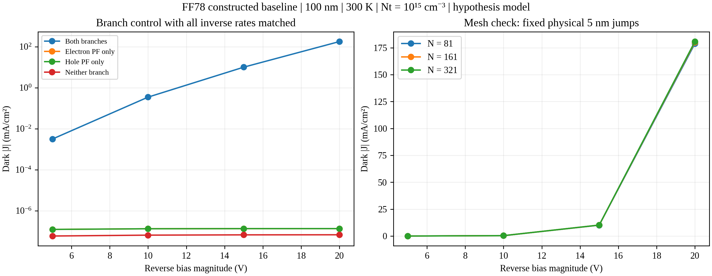

来源：45个新状态、独立率和通量审计 [D1]

### 180 mA每平方厘米到底从哪里来

对161节点、−20 V暗态解，独立按所有价态→中心→传导态循环重构的净对源为180.129109 mA/cm²，扣除双分子复合0.000023520 mA/cm²后，与端口180.129086 mA/cm²相符。电子与空穴从各自选择性端净输出，反向少数载流子接触流约1.54×10⁻¹⁴ mA/cm²。

因此，对这一特定解，把大电流说成主要由电极注入是不正确的。模型确实在体内持续跨隙产生配对载流子，并在电极提取。质疑它应针对产生机制的微观率，而不是把已核实的源误判为漏记的接触供给。

另有同种电子或空穴通过中心搬运的gross周转，每种等效约0.02717 mA/cm²，但它们的积分粒子源为零，不能再次加到端口产对电流中。独立按每条跳跃跨过哪些网格面组装非局域电流，与原累计源表达式一致。

光照−20 V代表点为约204.9654 mA/cm²，净陷阱对源仍约180.1235 mA/cm²。这个单点说明该参数下高反偏体源对光生浓度不敏感；它没有重新提取暗亮上翘电压，更不能充当实验配对验证。

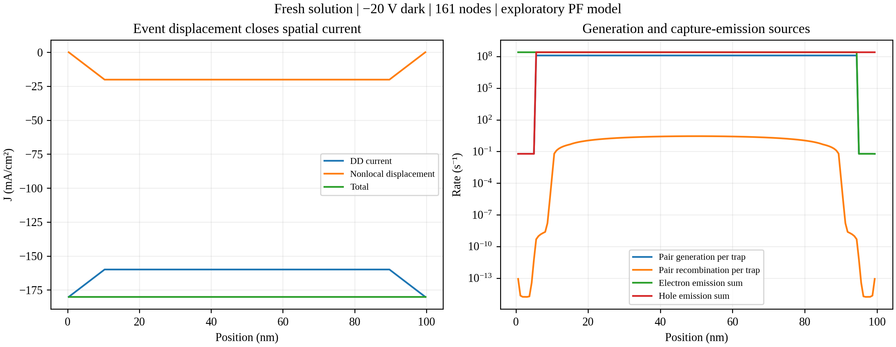

来源：四接触、循环源和跨面位移的独立重构 [D1]

### 场功成立不代表已经算出了发热

两步产生的端点能差之和为Eg−[φ(e)−φ(h)]。这里电场在电子和空穴分离时做功，恰好由端点电势差体现。PF项改变过渡态的动力学阻碍；不能再把端点已经计入的场功重复减去一次，以制造额外能量收益。

−20 V新解中，净跨隙能量率为0.2341678 W/cm²，产对循环场功0.3818701 W/cm²，二者之差为−0.1477022 W/cm²，表示沿该有利端点方向净下坡。同种输运场功另有0.00007528 W/cm²；全部非局域场功合计0.3819454 W/cm²，与独立积分JnlE吻合。

然而端口外电源输入VJ=3.6025817 W/cm²，全器件内部∫JtotalE dx=3.8187366 W/cm²，二者相差−VbiJ。原因是内部静电势差包含内建势，而外加电压只计端口驱动。接触的化学和能量边界项必须一起处理。

所以这次验证支持一个一致的受驱动能量解释，但没有求解完整接触热流、热浴功率、辐射、热传导或温升。把全部内部场功直接叫作瞬时发热，或由此给出某个温升，都会超出已完成的模型。

$$
\Delta_n(e)+\Delta_p(h)=E_g-[\phi(e)-\phi(h)]
$$

$$
P_{\mathrm{ext}}=VJ,\qquad\int_0^d J_{\mathrm{tot}}E\,dx=(V-V_{\mathrm{bi}})J
$$

| 新解中的能量率 | W/cm² | 如何解释 |
| --- | --- | --- |
| 端口输入 | 3.60258 | 外部电源功率 |
| 全部内部电场功 | 3.81874 | 含内建势贡献 |
| 非局域事件场功 | 0.381945 | 内部部分位移 |
| 两者不能直接相等 | 差0.216155 | 需接触能量项 |

来源：端点循环、化学势与电场功独立核验 [D1]

### 陷阱密度扫描展示了关联也暴露了假设

原有限距离PF存档扫描固定μ、接触、捕获系数与长度，只把Nt从10¹³扫到10¹⁷ cm⁻³。随着Nt增大，正向复合与空间电荷增强，FF下降；反向产生中心增多，指定电流阈值更早达到。这就自然产生了一条FF与反向阈值的关联，而不必手工规定二者函数关系。

例如Nt=10¹⁴时FF约80.18%、V50≈−20.62 V；10¹⁵时77.95%、−16.50 V；10¹⁶时68.57%、−12.82 V；10¹⁷时44.61%、−9.64 V。最低密度点在指定范围没有达到阈值，仍然留空。

但是，“同一参数可同时影响正向与反向”只能说明机制在结构上有可能产生关联。由于反向大源仍依赖双支降垒和远距耦合，当前关联不能反过来验证那两项假设，也不能从一条实验FF–K趋势唯一反推出Nt。

另一个隐藏变量是陷阱身份。SCLC或电容谱得到的浅态密度，未必是反偏跨隙产生所用的深中心密度；两者即使数值接近，也不能互换。必须同时说明密度、能量、电荷态和通道。

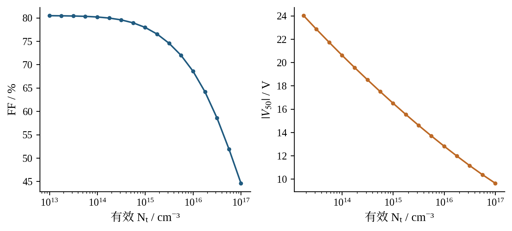

来源：pf_density_scan的完整CSV与代表点网格检查 [D0]

### 厚度斜率不是一种机制的指纹

若一个机制主要由局部场驱动，且其它因素变化较小，随厚度增大达到某场尺度可能需要更大电压，因此Vth与d近似线性并不意外。体产生、接触场增强以及局部薄区等不同模型，都可能产生这种趋势。

PF存档后来把厚度扩展为80、100、120、150、200 nm，共85组。Nt=10¹⁵的五厚度K50为0.15296 V/nm、截距1.18682 V；早期只拟合80–120 nm三点时K50约0.1581 V/nm。二者不同不是需要消掉的误差，而是拟合区间和非零截距的影响。

更重要的是扫描控制了总光生电流尺度Jgen=25 mA/cm²，因此G随1/d变化，并未计算吸收干涉、厚度导致的形貌和迁移率变化。这样的扫描适于隔离电学厚度效应，却不等于实际制备不同厚度器件的全部变化。

原数据同时保留40、50、75 mA/cm²阈值。若它们给出不同K，应把差别当作曲线形状的信息。高R²只表示在指定区间近似线性，不增加材料真实性；未达到阈值的厚度也不能用扫描终点补上。

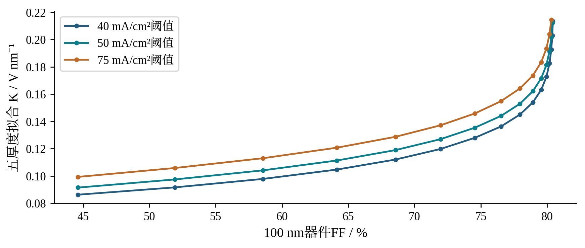

来源：pf_thickness_scan报告、device_metrics和thickness_fits [D0]

### Miller Abrahams跳跃加入了距离代价

Miller–Abrahams形式把电子态空间重叠写成指数衰减，并把上坡跃迁乘以Boltzmann因子；下坡跃迁在这项简化中没有额外激活罚因子。正反使用相同距离和前因子时，它满足正确的热力学速率比。

原工程的hopping实现不是WKB隧穿，也不是Marcus核。它在1.25–10 nm区间积分距离权重，采用振幅局域化长度0.7 nm、尝试尺度10¹² s⁻¹，并保留完整局域SRH。相比固定5 nm且无衰减前因子的PF模型，它至少显式支付了更远空间重叠的代价。

存档示例给FF约75.48%、V50≈−18.724 V、三厚度K50≈0.1751 V/nm。这显示该数学构成也可形成上翘，但参数未经目标缺陷标定；距离积分网格会带来细微波动，不能把图上的小曲率当成材料振动特征。

MA的下坡常数是近似。真实单声子率还依赖声子谱密度和Bose占据；某些微观有机体系计算已经显示与简化MA不同的距离及温度依赖。因此下一步不是从MA曲线反演一个“必然真实”的局域长度，而是检查哪些结论对核形式和可用态网络稳健。

$$
k_{\mathrm{MA}}=\nu_0e^{-2r/a}\exp\!\left[-\frac{\max(\Delta G,0)}{k_BT}\right]
$$

$$
k_{\downarrow}\propto J_{\mathrm{ph}}(|\Delta G|)[n_B(|\Delta G|)+1],\quad k_{\uparrow}\propto J_{\mathrm{ph}}(|\Delta G|)n_B(|\Delta G|)
$$

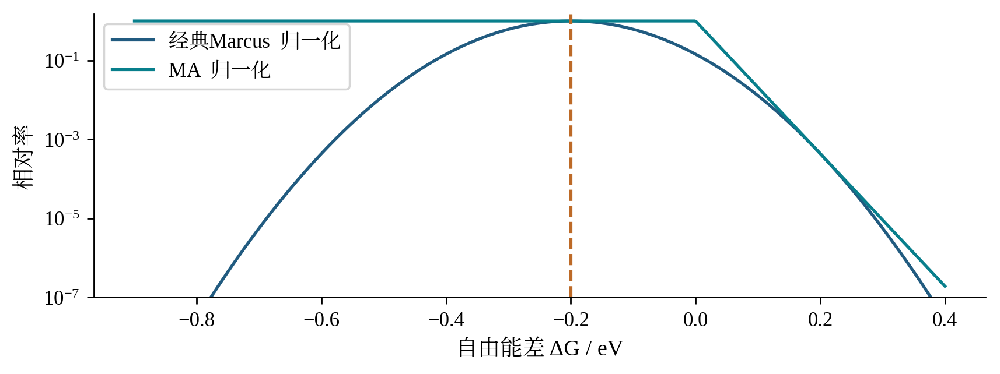

来源：MA原始模型 [R4]；有机输运形式 [R5]；微观反例 [R6]；存档实现 [D0]

### Marcus理论把核坐标显式放进问题

经典Marcus图像用两条自由能抛物面描述电子转移前后环境的不同最优核构型。ΔG是两个松弛端点的自由能差；λ是把初态环境形变到末态最优构型而不先转电子的重组代价。热涨落把系统带到两条面的交叉区域，弱电子耦合H控制穿越时的转移概率。

由谐性、经典热浴和非绝热近似可得下面的速率。势垒为(ΔG+λ)²/(4λ)：ΔG接近−λ时无激活；继续增加下坡驱动力，在单一抛物面模型中反而进入反转区。这个回落不应自动被称为实际有机反偏电流必有峰值，因为真实末态谱、振动态与其它路径可能改变它。

相同H和λ用于正反过程时，Marcus核严格满足exp(−ΔG/kBT)的比值。它数学上可以完全自洽，但若相关核模ħω不远小于kBT，在80 K便可能不再可靠；是否失效需实际频谱证据。因此“满足详细平衡”和“低温适用”是两个独立测试。

H、λ与ΔG必须对应同一条明确电荷转换。宿主单晶同种跳跃的H，或发光CT态拟合的λ，不能直接借给未识别缺陷的跨隙过程。

$$
k_M=\frac{2\pi|H|^2}{\hbar\sqrt{4\pi\lambda k_BT}}\exp\!\left[-\frac{(\Delta G+\lambda)^2}{4\lambda k_BT}\right]
$$

$$
E_a=\frac{(\Delta G+\lambda)^2}{4\lambda},\qquad E_{\mathrm{app}}=E_a-\frac{k_BT}{2}
$$

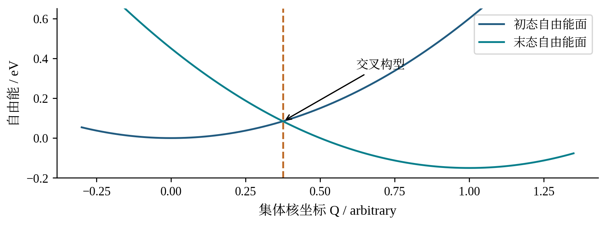

来源：Marcus原始理论 [R3]；低温率与MLJ讨论 [R7]

### 把距离变长场功更大但耦合更小

沿有利方向把端点分得更远，场能差qFr会更大；但波函数重叠往往下降，矩阵元H也会下降。只保留第一项而让前因子不变，就相当于给长距过程免费提高驱动力。固定长度桥或多步网络能否改善这一点，需要在固定端点、固定总耦合与真实带边限制下比较。

归一化Marcus或量子侧带核都有由H²与核宽度决定的峰高上界。若把归一化谱展宽，或把同一个总耦合分给多个末态，不能无条件突破核的最大值。把同一H复制到任意多个态其实增加了总耦合预算，不能称为“只是增加分辨率”。

本次压力测试取H(r)=20 meV exp[−(r−1 nm)/a]，r=5 nm。a=0.3、0.5、1.0 nm时，300 K理想两步源容量上限分别约3.15×10⁻⁸、1.35×10⁻³、4.03 A/cm²。如此巨大差别说明局域化长度是关键未知量，不能挑一个会产生大电流的a来证明机制。

即使容量上界很大，真实电流仍受可用完整图密度、占据、回跳、输运与散热约束。此前有限桥探索的完整旧代码已缺失，因此本书只保留“须固定预算比较”的原则，不把历史图重新包装成新验证结果。

$$
H(r)=H_0e^{-(r-r_0)/a},\qquad k_M\leq\frac{2\pi|H|^2}{\hbar\sqrt{4\pi\lambda k_BT}}
$$

$$
\sum_j|H_j|^2=H_{\mathrm{tot}}^2,\qquad J_{\mathrm{cap}}=qN_{\mathrm{graph}}dR
$$

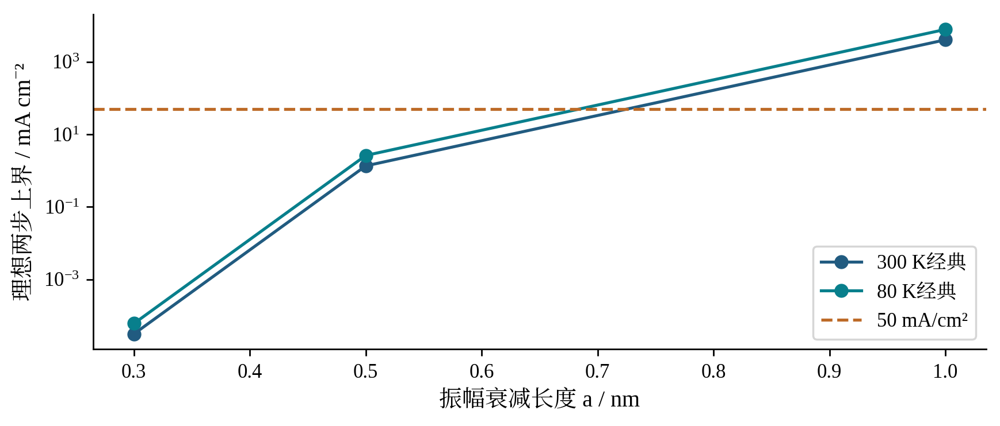

来源：归一核上界及固定耦合预算 [D3]；L8-BO host计算耦合 [R12]

### 多态复合中心与带边桥能解决什么

普通两态中心的双支吸引势矛盾，不会自动排除更复杂的电荷图。例如含三个电荷态的中心、电子空穴分居不同部位的复合体，或两个相邻缺陷，都可能让不同过程面对不同的局域势。但新状态必须付出形成能、占据与复位代价；“amphoteric”“negative-U”或“CT复合体”只是待具体化的物理类别，不能替代速率推导。

negative-U表示某些电荷态之间的有效相互作用使单占据态相对不利，往往与结构弛豫有关。即使它改变中间态稳定性，也没有取消从价态建立激发及把系统复位的能量账本。若涉及成对转移，状态空间、简并和电子数变化更应重新定义，不能继续沿用单电子四速率却只改一个能量符号。

固定跨度的真实带边桥是另一条路线：中间host态可以把一次长跳拆成较短几步，提升局部重叠，同时形成可逆输运路径。公平比较必须固定总跨度、总平方耦合、末态谱权重及端点能差；不能添加任意中隙阶梯，或让每一新边都免费得到原本整条路线的H。

即使桥改善了同种载流子输运，完整循环也可能仍被跨隙回填、回跳或端点解离限制。这正是为什么本书把host网络与真正的产生步骤分开。一个桥是否成功，应看完整净循环和同预算比较，而不是只看最快那条新边。

| 扩展方案 | 必须新增的账本 |
| --- | --- |
| 多电荷态中心 | 各电荷态形成能 简并 转换路径 |
| 双中心或CT复合体 | 空间电荷 库仑形成与分离 |
| negative-U或配对转移 | 电子数变化 结构弛豫 逆过程 |
| 固定跨度host桥 | 带边支持 总耦合预算 回跳及共享态 |

来源：方法性讨论；完整旧桥与多态专题未恢复，因此不提供其未经重算的数字。可复算新图见[D4] [D6]

### 顺序WKB通道描述的是另一类问题

WKB透射描述电子在固定能量下穿过空间势垒的指数小振幅。它与Marcus中的核重组概率不同；若要同时使用，必须说明电子在哪一步与声子交换能量、哪一部分势能进入ΔG，避免把场功或激活能重复计算。

原独立TAT模型用两个宽能带有效库和一个陷阱组成微结。左右势垒采用线性形状，积分得到作用量Si，再令Γi=νexp(−Si)。左右库以费米函数供给、接受电子，陷阱占据由两端进出平衡决定。由此得到单通道净率ΓLΓR/(ΓL+ΓR)乘(fL−fR)。

这是一种弹性、非相干、顺序通道。它没有真实HOMO/LUMO带边与局部DOS筛选，未把新增陷阱电荷反馈到Poisson，所以是带微观率的缩约并联支路，不是已经自洽的体相TAT产生模型。它的电子来自两个有效储库，不应另算成新的光生或体产对。

通道面密度Npath表示贯通的完整并联通道数量。把Nt×d直接放进去，可能把许多串联微结重复计成各自贯通的并联通道。这个几何计数问题不能靠速率守恒解决。

$$
S_i(E)=\frac{2}{\hbar}\int\sqrt{2m^*\max[U_i(x)-E,0]}\,dx,\quad\Gamma_i=\nu e^{-S_i}
$$

$$
f_t=\frac{\Gamma_Lf_L+\Gamma_Rf_R}{\Gamma_L+\Gamma_R},\quad R=\frac{\Gamma_L\Gamma_R}{\Gamma_L+\Gamma_R}(f_L-f_R)
$$

$$
J_{\mathrm{TAT}}=qN_{\mathrm{path}}\langle R\rangle
$$

来源：独立tat_model.py及解析WKB核验 [D0]；声子辅助深中心过程背景 [R9a] [R9b]

### 弹性TAT例子并没有同时解释所有现象

原TAT示例取每段2 nm、有效质量0.2me、势垒0.65 eV、陷阱高斯宽0.08 eV、尝试频率10¹² s⁻¹和Npath=10⁹ cm⁻²。所有这些都是探索值，并非从D18:L8-BO测得。势垒长度与质量共同进入WKB作用量，单条曲线无法唯一辨认二者。

在100 nm、300 K的FF78参照上并入此支路，FF降为53.69%，V50约−3.088 V，三厚度K50约0.03056 V/nm。高场曲线还出现回落，V75未达到。这说明一个可以产生反向大电流的通道，也可能过早破坏正向工作区，不能只看反向上翘就称解释成功。

本次温度审计又重新调用该弹性支路：0.1 MV/cm的80/300 K电流约9.698/8.765 mA/cm²；1 MV/cm约47.719/46.671 mA/cm²。Γ即使没有显式温度项，费米占据窗口仍会带来温度变化，所以“隧穿温度无关”不是完整器件电流的普遍结论。

下一步若保留这个候选，应显式加入可用带边、归一DOS、声子过程和真实空间供给，随后再与DD电荷及电势联立。不能添加任意Arrhenius倍率，只为把温度趋势改成预期方向。

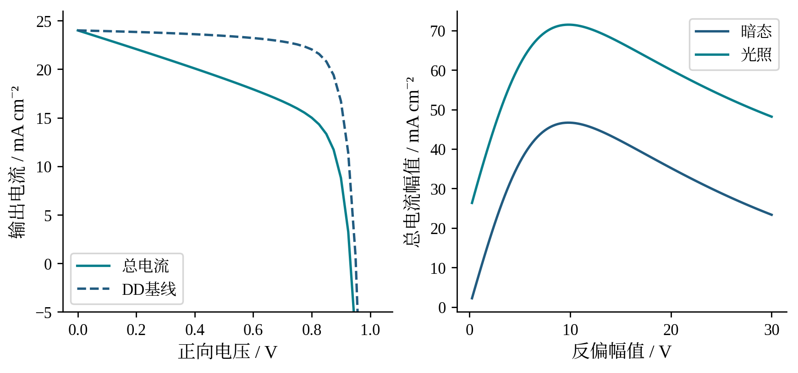

来源：TAT_MODEL_REPORT与tat_results [D0]；独立低温占据诊断 [D3]

### 接触注入能画上翘但还未闭合空间电荷

原接触候选采用对称有效Schottky并联支路：势垒受外加名义场降低，热发射尺度乘以一个tanh净流因子，使零偏电流为零、正反偏具有对称响应。默认势垒0.60 eV、前因子10⁴ A/cm²，均是探索参数，不是测得的有机Richardson常数。

该示例给FF约77.97%、V50≈−17.288 V、K50≈0.1727 V/nm。改变注入势垒可以明显移动反向阈值，但对正向FF影响很小。这种差异本身有信息量：若实验FF跨度很大，还需界面复合或提取变化，不能只靠当前并联支路解释所有关联。

数学上，支路电流由外部储库供给，并满足被设定的端口对称性；器件物理上，它没有把注入电荷重新送入Poisson和连续性求解，没有解析势垒的空间形状、局部带尾或接触附近复合。因此不能把该图当成完整注入机制已经被验证。

已核的PDINN原始研究表明，界面层可以显著改变Ag功函数。它支持接触值得研究，却不意味着用户器件的0.60 eV有效势垒已经被测量。未来真正的接触比较应在相同材料能级、局部谱和边界电化学势下进行。

$$
J_{\mathrm{inj}}=J_{00}\left(\frac{T}{300}\right)^2 e^{-\max(\Phi-\Delta_S,0)/(k_BT)}\tanh\!\left(\frac{V}{2nk_BT}\right)
$$

| 当前支路已包含 | 尚未包含 |
| --- | --- |
| 外加名义场与有效降垒 | 自洽注入空间电荷 |
| 有限势垒和温度因子 | 真实有机界面DOS |
| 零偏净流为零 | 逐空间位置的产生复合 |
| 与基准端口电流相加 | 新边界与DD联合求解 |

来源：reduced_models.py及存档比较 [D0]；PDINN界面原始证据 [R13]

### 电热反馈有自己的动力学与稳定性

热模型把吸收光功率与端口电功率加入温度方程，再用热阻将能量散向环境。反偏时V和J同号，VJ为正；发电区VJ为负，代表电能输出。漏电导随温度增加，温升又增加漏电，于是可能形成正反馈。这个机制不需要把每次载流子加速都叫作雪崩。

原示例采用Rth=100 K·cm²/W、面积热容0.02 J/(cm²·K)、吸收0.08 W/cm²和漏电激活能0.55 eV。零偏光照初温约308 K，默认2 V/s反扫给V50≈−11.742 V。430 K仅是模型有效温区的计算停止点，没有损伤变量，不能称为烧毁温度。

稳态热平衡是功率净流为零；局部稳定还要求升温时净输入下降。瞬态扫描可能滞后于稳态分支，所以脉冲长度、扫描速度和初始温度会影响曲线。相反，Newton在某电压不收敛并不等于这条热稳定条件被违反。

当前模型是集总温度，不解析局部热点或热界面；K50接近零也与Rth及漏电支路不随厚度变化有关。它不排除别的热边界下存在厚度比例关系，更不能因液氮浴稳定就排除薄膜局部自热。

$$
C_A\dot T=P_{\mathrm{abs}}+VJ(V,T)-\frac{T-T_b}{R_A}
$$

$$
\mathrm{steady}:\ H(T)=0,\qquad\mathrm{stable}:\ \partial_T H<0
$$

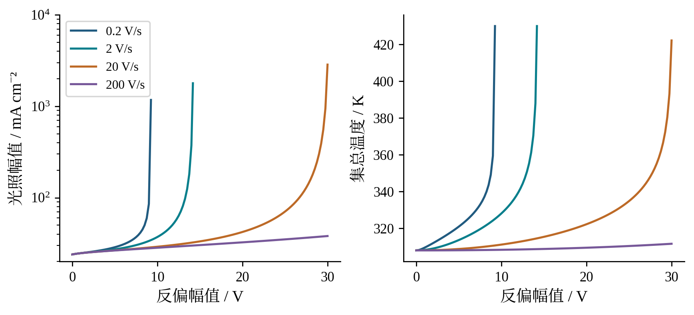

来源：热方程、初态及停止条件 [D0]

### 弱区与经验支路分别能说明多少

弱区模型把器件看成良好区域与少量差区域的并联。差区域有自己的较薄DD列、更高陷阱及附加注入、欧姆泄漏；每个局部电流先按局部面积定义，再乘面积比例。这能说明少量薄区或缺陷如何拉低FF并提前反向增长。

原默认弱区比例1%、厚度为良区一半，给FF约76.52%、V50≈−17.090 V、K50≈0.1594 V/nm。它没有横向电场集中、热点迁移、随机缺陷分布或导电丝生长，因此只能作面积加权的存在性例子，不能称为微观击穿通道重建。

经验支路J=GVexp(−V0/|V|)则更直接：它可以描述随电压急剧增大的被动漏电，并与基准光伏电流相加。默认例子几乎保持78%FF，V50约−17.036 V，但K50近零，因为该函数的关键尺度是电压而非场。

经验拟合不是没有用。它能压缩曲线、比较阈值和提供插值；错误在于把一个拟合电压尺度V0自动解释成陷阱深度或隧穿长度。本项目的科学目标要求“曲线描述有效”与“微观解释成立”分开记分。

$$
J_{\mathrm{area}}=(1-f_A)J_{\mathrm{good}}+f_AJ_{\mathrm{bad}}
$$

$$
J_{\mathrm{emp}}=GV\exp[-V_0/|V|]
$$

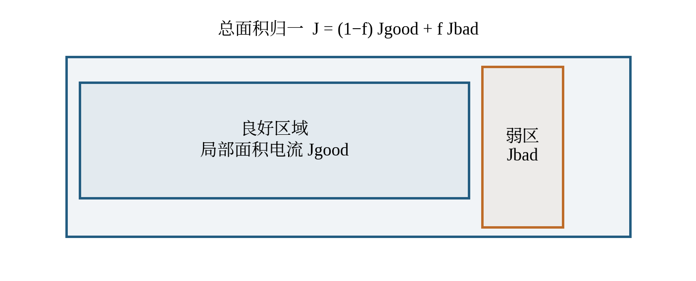

来源：缩约弱区、经验支路源码与存档结果 [D0]

## 第四部分 材料约束与低温理论

### 材料能级存在多种测量口径

D18:L8-BO不是一个唯一能级数字。最常见的误用是从不同论文各取一个HOMO或LUMO，再相减称为测得的输运隙，随后同时控制ni、接触与陷阱深度。CV、UPS、PESA和IPES的对象、环境与推算步骤并不完全相同；纯膜前沿差也不等于共混界面的CT自由能。

原D18论文CV给HOMO−5.51 eV；L8-BO原始论文CV给LUMO−3.90 eV，两者相减为1.61 eV。另一篇同文PESA/IPES表列D18−5.39、L8-BO−3.98 eV，差1.41 eV。2026年UPS结合CV隙推算的一组值则给差1.64 eV；其中L8-BO的−3.45 eV并非IPES直接测得。

这三个数是方法分支，不是可以平均的误差条。若进入ni的自由电荷差从1.30改成1.61 eV，在其它量固定时300 K的ni就缩为约0.00249倍，ni²为6.20×10⁻⁶倍。用Nt或c重新拟合可以掩盖口径错误，因此能量定义必须先于曲线调参。

本书不选择一个“正确新Eg”替代原值。目标Efree、ECT、缺陷电荷转换能仍分开留空；旧1.3 eV只保留为构造基准。

$$
\frac{n_i(E_2)}{n_i(E_1)}=e^{-(E_2-E_1)/(2k_BT)}
$$

| 能级来源 | D18 HOMO | L8-BO LUMO | 差值 |
| --- | --- | --- | --- |
| 跨文献CV | −5.51 | −3.90 | 1.61 eV |
| 同文PESA/IPES | −5.39 | −3.98 | 1.41 eV |
| UPS加CV隙推算 | −5.09 | −3.45 推算 | 1.64 eV |

来源：原始能级和处理口径 [R11] [R12] [R15] [R16]；材料审计 [D5]

### 迁移率必须作为成套文献场景使用

最接近当前质量比的原始来源为Zhu等2022年正式SI：D18:L8-BO=1:1.2、单载流子膜约120 nm，含陷阱DD反演得到trap-free μe=1.40×10⁻³、μh=1.80×10⁻³ cm²/Vs。它与直接Mott–Gurney斜率的“有效迁移率”不是同一个观测量。

另一项1:1.5、88 nm研究给μe约9.63×10⁻⁴、μh约4.98×10⁻⁵，电子空穴比约19；1:1.4研究给4.39×10⁻⁴和2.71×10⁻⁴，比约1.62。同一材料名下出现不同失衡程度并不奇怪，因为制程、接触、膜厚及反演假设都参与决定。

SCLC关系中μ与所取介电常数、d³和有效电压相关。把一篇的μe、另一篇的μh、第三篇的ε拼成“最佳参数组”，会丢掉这些条件关联。更合理的是保留成对场景，并明确它们不是当前器件标定。

文献εr=4.36来自一种不同接触工艺的频率依赖电容；2022年DD中的εr=3却是固定输入。低频器件介电响应也不能自动当作亚纳米缺陷快速转移的局部屏蔽。当前FF78 μ≈0.00452较上述同质量比文献值高约2.5–3.2倍，但本来就是FF构造值，不能误指其曾宣称实测。

| 分支 | μe | μh | 性质 |
| --- | --- | --- | --- |
| 1:1.2 120 nm | 1.40×10⁻³ | 1.80×10⁻³ | 含陷阱DD反演 |
| 1:1.5 88 nm | 9.63×10⁻⁴ | 4.98×10⁻⁵ | 有效SCLC |
| 1:1.4 | 4.39×10⁻⁴ | 2.71×10⁻⁴ | 有效SCLC |
| FF78构造 | 4.525×10⁻³ | 4.525×10⁻³ | 非材料标定 |

来源：μ单位均为cm²/Vs；原始来源 [R17] [R18] [R19] [R20]；23行证据 [D5]

### 浅陷阱 光学尾与深中心不是同一参数

2022年同质量比研究用C–f估计局域高斯陷阱总密度约3.76×10¹⁵ cm⁻³、带边深度0.164 eV、宽度18 meV，再作为DD输入反演SCLC。这些是electron或hole各自的Gaussian输入，并非已证明一个中心负责两支跨隙产生。整套反演还固定Eg=1.32 eV、εr=3、Nc/Nv=10²⁰ cm⁻³及捕获截面。同篇另有阻抗输运DOS无序度66.8 meV；另一篇s-EQE光学尾给Urbach能26.71 meV。这些值并存，已经说明“宽度σ”不是一个跨方法通用的数字。

原模型对称中带隙为0.65/0.65 eV。若保持Eg=1.3 eV，把电子深度改为0.164 eV，则完整跨隙另一支必须为1.136 eV，不能把两支都变成0.164 eV。如此不对称的诊断电流远小于原模型；这仍不是把浅陷阱身份认定为真正产生中心，而是说明定义不应混用。

另一个2026电容DOS表列5.52×10¹⁶ cm⁻³ eV⁻¹，正文归一公式却将Nt称作总密度。单位与归一化存在歧义，不能直接填入积分Nt。该SI中还出现迁移率比值与两列算术不符，本书保留警告，没有悄悄改原数据。

L8-BO单晶ZINDO耦合14.8–19.0 meV也只属于host–host堆积。目标缺陷的λ、H、局域长度、俘获系数、振动谱和图密度仍未测得。保留空值是防止假精确，不是停止理论研究。

$$
D_n+D_p=E_g,\qquad 0.164+1.136=1.300\ \mathrm{eV}
$$

| 可查到的量 | 不能直接替代 |
| --- | --- |
| 光学Urbach能26.71 meV | 输运Gaussian σ |
| 局域陷阱宽18 meV | 重组能λ |
| IS无序度66.8 meV | 唯一化学缺陷深度 |
| 每eV的DOS幅度 | 积分总Nt |
| host单晶耦合 | 缺陷跨隙H |

来源：材料原文与SI核对 [R12] [R17] [R19] [R20]；缺失项清单 [D5]

### 液氮温区首先改变哪些近似

77 K的kBT约6.64 meV，80 K约6.89 meV。许多分子振动的能量可以明显高于这个尺度，因此“核坐标总是经典热涨落”的假设需要重新检查。即使室温，150 meV振动的能量仍约为5.8kBT，不能自动视作经典低频模。

对谐振子，量子均方位移与经典均方位移之比为(x/2)coth(x/2)，x=ħω/kBT。80 K、10 meV模的差别约17%，20 meV约62%，150 meV则相差约10.9倍。这里模能量只是量级示例，并未测为D18缺陷的实际活跃模。

但“有量子修正”并不意味着低温暗电流必然巨大。上坡过程仍需要能量，稀有热初态可能决定反向率，端点回填仍可能冻结，输运和接触也会改变。只看某个电子逃逸因子的温度依赖，无法决定整个器件的温度系数。

同样，给经典Marcus加上量子高频模后，低频浴可能仍被经典近似处理。若未确认低频谱足够软，就不能声称77 K理论已经精确。λs是低频重组能总量，不是一个振动频率。

$$
k_BT(80\ \mathrm{K})=6.894\ \mathrm{meV}
$$

$$
\frac{\langle Q^2\rangle_q}{\langle Q^2\rangle_{cl}}=\frac{x}{2}\coth\!\left(\frac{x}{2}\right),\quad x=\frac{\hbar\omega}{k_BT}
$$

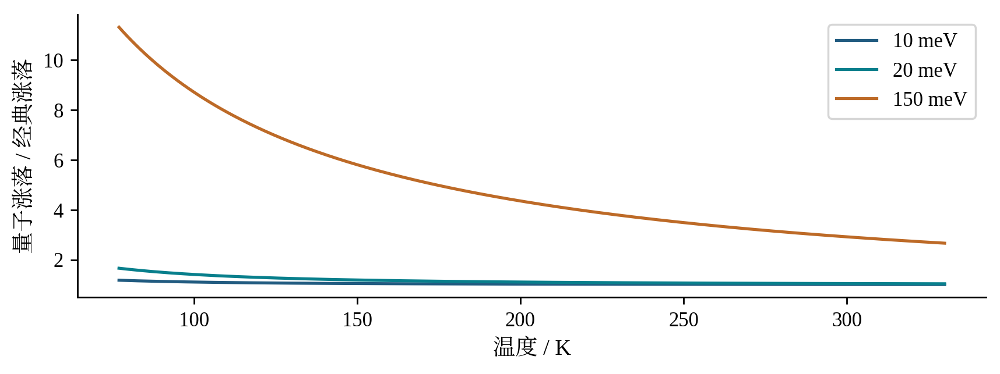

来源：低温核尺度与适用性审计 [D3]；原始量子率讨论 [R7] [R8]

### 有限温度振动核为何要有正负侧带

用一支等频位移谐振子描述高频核模，以经典高斯浴描述低频部分，可以构造有限温度的振动侧带核。l为浴吸收的振动量子数，既可为正也可为负；负l对应需要从热初态吸收能量的过程。其权重由Bessel函数与Bose占据给出：nB=1/[exp(ħω/kBT)−1]，S是无量纲Huang–Rhys因子，I是第一类修正Bessel函数；总重组能λtotal=λs+Sħω。

侧带权重总和为1，并满足p−l=exp(−lħω/kBT)pl。把它与低频经典核卷积后，可以用l→−l换元证明正确的正反比。这个证明比单独检查正向率更重要，因为极少量高能初态虽然对总概率贡献小，却可能主导稀有上坡跃迁。

本次比较固定H=10 μeV、总λ=0.20 eV；量子分配为λs=0.05 eV、ħω=0.15 eV、S=1。80 K、ΔG=−0.60 eV时，量子率约3.69×10⁴ s⁻¹，经典率约1.82×10⁻⁶ s⁻¹，差约2×10¹⁰倍。但ΔG=+0.35 eV时，量子率仍仅约2.38×10⁻¹⁶ s⁻¹，上坡并未免费完成。

这些是同预算的核比较，不能把探索模和H解释成已确定的材料参数。它主要反驳“经典单核的低温强驱动回落就是材料结论”。

$$
p_l=e^{-S(2n_B+1)}I_{|l|}(2S\sqrt{n_B(n_B+1)})e^{l\hbar\omega/(2k_BT)}
$$

$$
k_Q=\frac{2\pi|H|^2}{\hbar\sqrt{4\pi\lambda_s k_BT}}\sum_{l=-\infty}^{\infty}p_l e^{-(\Delta G+\lambda_s+l\hbar\omega)^2/(4\lambda_s k_BT)}
$$

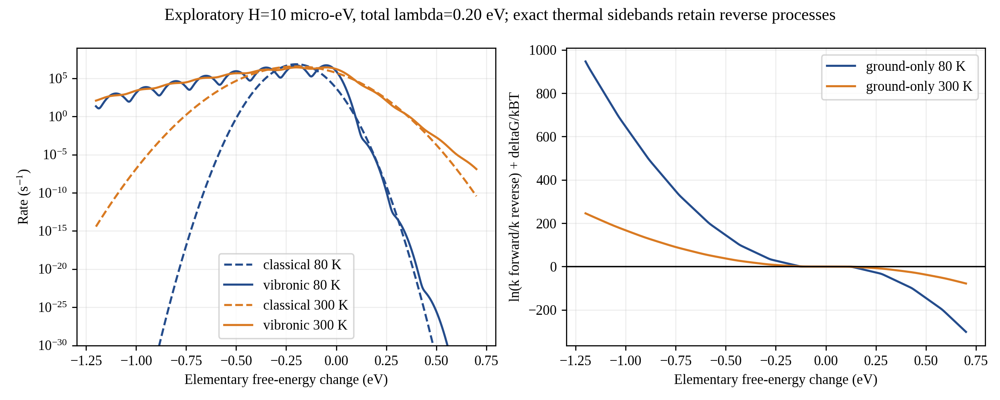

来源：有限温度侧带 [R8]；一般Franck–Condon核 [R7]；独立双和验证 [D3]

### 只改正负号会制造伪平衡电流

常见低温MLJ简化只保留初态振动基态，侧带权重为泊松分布且l≥0。它可近似某些下坡过程，但若对反向过程仅把ΔG改号，再调用同一个截断公式，就不保证对应同一有限温度热浴。

本次错误实现进入完整8态图后，在共同电化学势、300 K、1.5 MV/cm产生约1354 s⁻¹的伪平衡循环。概率可以仍然归一，电子数可以守恒，状态能量账本也可能闭合；然而循环亲和力和实际浴热所对应的熵产生不一致，问题属于热力学错误，而不是“材料增强”。

另一个反例是在共同μ下把价端强制只进不出、传导端只出不进，得到约5.00×10⁵ s⁻¹的循环。若明确声明这是主动泵或无限偏置吸收库，可以研究它的容量；但不能同时称它是共同μ热平衡器件。

因此验收不能停在电荷与能量守恒。还要检查每条正反率对应同一热浴、共同μ时逐边零流、闭环亲和力与储库驱动一致。正确的一方向近似可以通过严格比值构造反向，但这只修复比值，仍需验证正向绝对率的适用性。

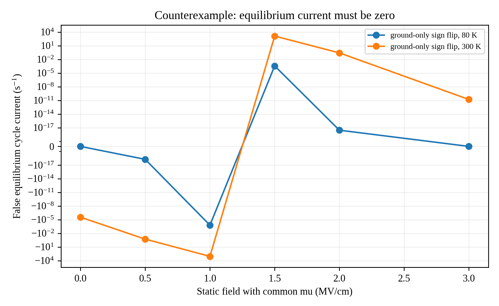

来源：量子图错误控制与循环亲和力 [D4]

### 把产生与复位放进八个可逆状态

新的局部图使用价态V、缺陷D、传导态C三个带标签单占据轨道，每个只能放0或1个电子，忽略自旋简并，因此共有8个占据构型。内部只允许V↔D和D↔C，并要求初态有电子、末态为空；端点再与各自储库可逆交换。

一条代表循环为100→010→001→000→100。第一步价态电子进缺陷留下空穴；第二步同一电子进传导态；第三步电子导出；第四步价态空穴回填。它是一对激发的完整循环，不能把前两步分别计两对。

图还允许先回填再发射等其它顺序，并允许多个电子同时存在。因此它不是“一次只能一个电子占据整个图”的单串行四步模型，简单等待时间相加不再处处成立。完整主方程同时处理占据阻塞、回跳与构型依赖能量。

本次固定位置−5、0、+5 nm，裸松弛能−0.65、0、+0.65 eV，核心电荷为(+1,0,0)，状态电荷qi=bi−ni。主协议φi=0.1Fxi V，xi用nm、F用MV/cm；μV=+0.5F eV、μC=−0.5F eV。F为利于电子向+x的幅度，实际E=−∇φ；共同μ非零场是另行平衡控制。总能含裸能、静电势和两两库仑项，没有给同一个两态中心强行加两种相同PF尾势。该8态图是新重建的探索模型，不是恢复的历史程序或材料分子结构。

$$
G(\mathbf{n};F)=\sum_i\epsilon_i(n_i-b_i)+\sum_iq_i\phi_i+\sum_{i<j}\frac{Aq_iq_j}{r_{ij}}
$$

$$
\dot P_i=\sum_j(k_{ji}P_j-k_{ij}P_i),\qquad\sum_iP_i=1
$$

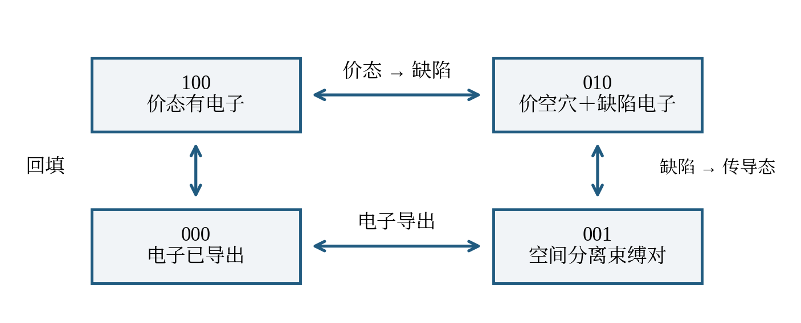

来源：新3位点8态图与状态能定义 [D4]

### 量子修正保留了高场率却没有消除低场瓶颈

固定几何、内部H各10 μeV、总λ=0.20 eV和端点交换率各10⁶ s⁻¹，主扫描比较经典与有限温度量子核。80 K、0.5 MV/cm，量子净循环仅约1.92×10⁻²⁰ s⁻¹；到1.5 MV/cm为5.00×10⁵ s⁻¹；3 MV/cm仍为3294.9 s⁻¹，而经典核在该强驱动点回落到4.30×10⁻³⁶ s⁻¹。

这说明完整占据、库仑及复位并未抹去量子核与经典核的巨大差别。但量子核不是处处更快：在1 MV/cm的若干点反而略慢。高场弱温度依赖也不能推广到全场域，低场仍可因上坡形成而变化许多数量级。

若额外假设独立有效图密度10¹⁵ cm⁻³、100 nm厚度与完全收集，Γ=10⁶ s⁻¹本身就给约1.602 mA/cm²容量上限。量子主扫描的条件峰值在80和300 K分别约0.822和0.840 mA/cm²，均未到50 mA/cm²。没有V50就留空，不用峰位替代上翘。

此外，局部循环的内部位移仅10 nm，在100 nm器件中只完成约十分之一的加权电荷位移；其余载流子运动还需真实输运模型。把qNgraphdR叫作容量换算，不能省略完全收集等前提。

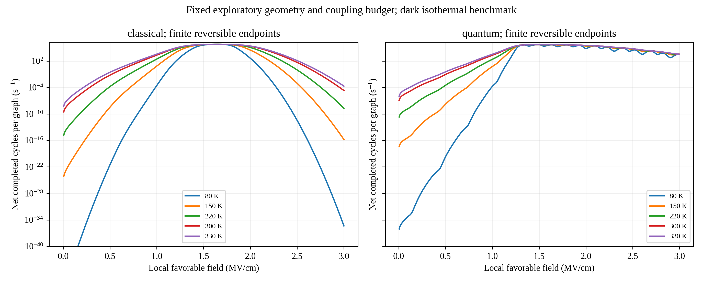

来源：固定预算量子图主扫描与28点独立生成树核验 [D4]

### 端点堵塞与提取反馈可以改变结论

80 K、1.5 MV/cm时，两端交换都很慢会把图堵住。若ΓV=100 s⁻¹而ΓC=10⁶，价端很快缺电子；反过来，传导端几乎被填满。两个极限都把净循环限制到约100 s⁻¹附近，因此冻结端点满空占据不能被当作已经处理提取。

更细的诊断发现，提取也未必越快越好。80 K、2 MV/cm的含库仑量子图在Γ≈5.01×10⁵ s⁻¹达到约73620 s⁻¹；继续到10¹⁰ s⁻¹，净率降到约50646 s⁻¹。关闭库仑控制后，扫描内恢复单调。

原因是占据改变了形成步骤的电荷构型。C已经有电子时，V→D的能差与C空时不同，在该驱动力附近反而对应更快的量子或经典核；极快提取让这条有利条件支路消失。这个非单调也存在于经典核，因此不能归因于量子振动独有。

这并不等于应该故意让器件提取变差。慢到造成堵塞时通量仍趋近零；在真实器件中，端点积累还会反馈电势与库仑关系。局部图只揭示占据—能量—速率之间的闭环，尚未完成全器件优化。

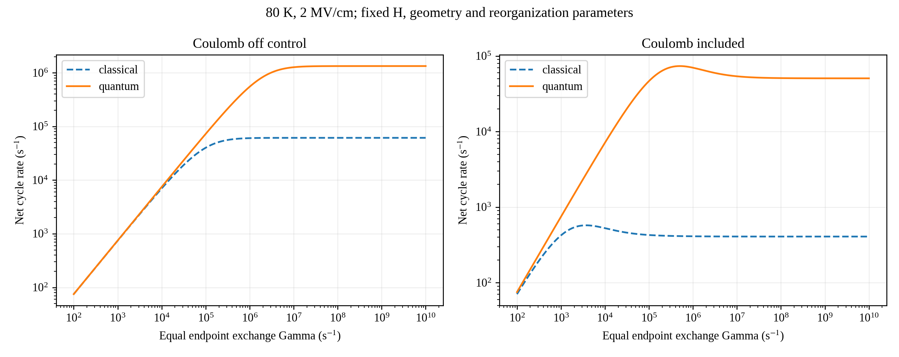

来源：端点堵塞、构型分支与提取非单调 [D4]

### 常数储库速率隐藏了哪些能谱假设

常Γf与Γ(1−f)可以完全满足详细平衡，却没有告诉我们附近真实宿主有没有可交换的电子态，以及交换是否需要吸收声子。为隔离这个问题，新阶段保持同一8态骨架、内部耦合和重组核，给价库与传导库各一个宽1 eV、积分为1的单侧能谱。

价谱只在EV以下，传导谱只在EC以上。向端点加入一个电子的图能差为a，储库实际电子能量为ε。正向积分必须乘f(ε)，反向出射必须乘1−f(ε)；同一可逆核处理a−ε和ε−a。逐能量的两个比值相乘后ε消去，所以积分仍满足正确的热力学比。

按2πHα²/(ħW)=10⁶ s⁻¹匹配旧交换强度，得到Hα约10.235 μeV。这是谱强度与单位匹配，没有用目标电流调参数。但新Γeff=k加+k减会随构型、温度和谱支持域变化，不再是已知常数。

80 K、1.5 MV/cm的量子循环从常Γ的500482 s⁻¹降为单侧谱188.638 s⁻¹；同预算的对称宽谱允许原带隙侧态后，又回到483197 s⁻¹。区别来自可用交换能量，并非详细平衡突然失效。

$$
k_+(a)=\int \rho(\epsilon)K(a-\epsilon)f(\epsilon)\,d\epsilon
$$

$$
k_-(a)=\int \rho(\epsilon)K(\epsilon-a)[1-f(\epsilon)]\,d\epsilon
$$

$$
\frac{k_+}{k_-}=e^{-(a-\mu)/(k_BT)}
$$

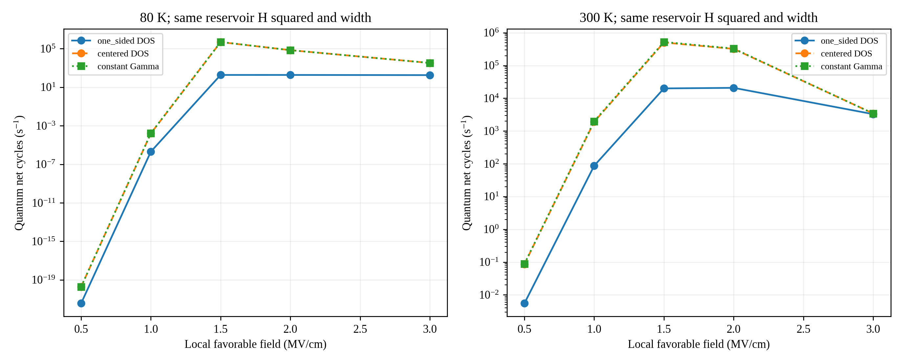

来源：21636点有限谱交换重算与独立求积 [D6]

### 束缚对复位成为新的慢步骤

在上述单侧谱、80 K、1.5 MV/cm点，图约98.984%的概率停在001，即V处有空穴、C处有电子，两者相隔10 nm。库仑结合能约0.04114 eV。内部V→D和D→C转移已经能达到每秒数百万次，但电子导出和空穴回填各只有约95.287 s⁻¹。

原因可以逐步讲清：传导电子的添加能低于当地传导连续谱下边缘，导出需要吸收能量；价谱中的已有电子必须跃迁到高于价谱上边缘的图添加能，因此同样需要吸收能量。两个出口合起来控制完整循环约188.638 s⁻¹。量子内部逃逸再快，也不能跳过这个端点瓶颈。

这个结果仍不是D18:L8-BO上限。连续库接走粒子后，不再显式保留它与图内另一电荷的相关作用，这本身是开放浴粗粒化；真实载流子继续空间分离还可能获得更多场功。因此下一步应显式加入进一步分离和回填状态，同时保持总跨度与总耦合预算，不能把终端库移远却不支付重叠衰减。

同一模型还允许声子浴局部吸热。80 K、0.5 MV/cm每净循环声子热约−0.815 eV，电子库热约+1.315 eV，总热仍为+0.5 eV外部化学功。只看声子一项就判断违反第二定律，会漏掉电子库能量。

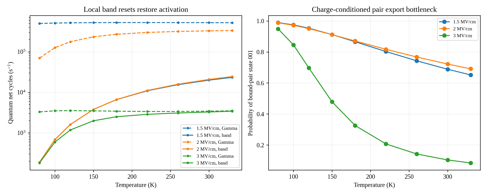

来源：束缚对态概率、逐边率及物理热分配 [D6]

### 固定化学势与固定载流子数不是同一温扫

为了避免符号混淆，这里把化学势写为μch，迁移率写为μmob。若DOS给定，载流子浓度由费米积分决定。固定μch时，冷却通常改变n；固定n时，则必须反求μch(T)。实际有偏器件还由接触、空间电荷和复合联合决定，不能无说明地把二者同时固定。

取同材料文献输运DOS宽度66.8 meV作为数学场景，在300 K令n/N=10⁻⁴，可得μch−E0≈−0.32356 eV。冷到80 K，固定该μch时费米积分给n/N≈9.916×10⁻⁷；若坚持n/N=10⁻⁴，化学势需移到约−0.25291 eV。两种计算回答的是不同问题。

更严重的反例是把整个无限高斯尾都当作稀占据，盲用Boltzmann积分，会在80 K给n/N≈1.0114，超过总态容量。这不是材料突然产生很多电子，而是非简并近似失效。真实低温DOS还可能有有限宽度、库仑关联与非平衡冻结。

同理，锐带边的ni公式只有在相应态数与稀占据假设下成立。不能把无机抛物带Nc∝T³ᐟ²或固定分子态数两种不同图像随意混用，更不能只改temperature而把其它发射、俘获关系留在室温定义。

$$
n(T,\mu_{\mathrm{ch}})=\int g(E)\frac{dE}{1+e^{(E-\mu_{\mathrm{ch}})/(k_BT)}}
$$

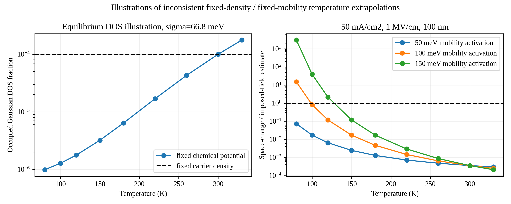

来源：费米容量反例和输入范围 [D3]；同材料IS宽度来源 [R17]

### 源产生得快还要把电荷运到电极

微观源率足够大，并不意味着器件端口能够收集同样电流。简单均匀漂移估计给τtr≈d/(μmobF)，而支持某个电流需要n≈|J|/(qμmobF)。冷却后若μ显著下降，提取时间可能比局部反应慢许多，并引起占据、复合及空间电荷反馈。

量级压力测试取μ300为FF78值，迁移激活能0.10 eV、F=1 MV/cm。300 K的渡越约2.21 ns，80 K约92.1 μs。要支持50 mA/cm²，估算n从6.90×10¹³增到2.87×10¹⁸ cm⁻³。相应单极空间电荷量级qnd/(εF)从3.57×10⁻⁴增到14.9，提醒固定场和稀密度假设可能同时失效。

这些不是新DD解。电子和空穴的局部抵消、真实低温μ(T,F,n)、接触与陷阱都会改变估计。它们的作用是阻止我们在量子核中得到较快速率后，立刻假定全器件完全收集。

在最小近态竞争中，提取概率为u/(u+b)，u为继续离开速率、b为返回率。这个因子展示了回跳的重要性；完整多态网络则需一起求占据。未来接入DD时，局部图净源、图电荷与全部跳跃电流必须同时反馈。

$$
\tau_{\mathrm{tr}}\simeq\frac{d}{\mu_{\mathrm{mob}}F},\qquad n\simeq\frac{|J|}{q\mu_{\mathrm{mob}}F},\qquad \chi_{\mathrm{sc}}=\frac{qnd}{\varepsilon F}
$$

$$
P_{\mathrm{escape}}=\frac{u}{u+b}
$$

| 量级测试 | 300 K | 80 K |
| --- | --- | --- |
| μmob  cm²/Vs | 4.52×10⁻³ | 1.09×10⁻⁷ |
| 渡越时间 | 2.21 ns | 92.1 μs |
| 50 mA/cm²所需n | 6.90×10¹³ | 2.87×10¹⁸ cm⁻³ |
| 单极χsc | 3.57×10⁻⁴ | 14.9 |

来源：探索Eμ=0.10 eV，不是D18低温拟合；计算与边界 [D3]

## 第五部分 数值可靠性与解释边界

### 求解器停住为什么不能叫击穿

原0.164/1.136 eV不对称诊断在−8.4 V续接失败。独立检查发现稀疏Jacobian方向导数正确，线性方程也求得足够准；真正问题是某个极低空穴浓度的log-Newton步不断变大，触发全局阻尼，导致全部变量几乎不能移动。

原初猜只在新电压立即改变右接触电势，内部还沿用旧值，额外电势跳变集中在最靠边的一格。给内部电势增加一个线性预测，保持n、p初猜及所有物理方程不变，就能连续达到−20 V。这证明原失败至少可以是求根路径问题，不能被解释为该电压不存在稳态或发生材料损坏。

这里的Newton迭代编号不是物理时间。一个发散迭代不能当作电流随真实时间失控；相反，找到一个稳态代数根，也不证明它对真实时间扰动稳定。动态稳定需要时域方程或线性化谱，热稳定还要相应的能量方程。

本次修复没有改变势垒、密度或耦合来迎合电流。它先修初猜，再区分输出精度问题；这比把步长减小后仍失败的区间简单画成断崖更有物理意义。

$$
\psi_{\mathrm{guess,new}}(x)=\psi_{\mathrm{old}}(x)-\frac{\Delta V}{V_T}\frac{x}{d},\qquad\psi=\frac{\phi}{V_T}
$$

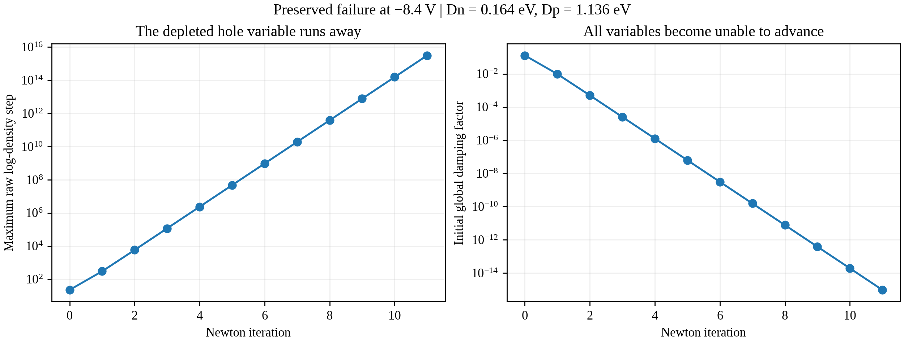

来源：独立Jacobian、阻尼和四种失败控制 [D2]

### 准费米变量与物理预算修复微小电流

在另一个−5 V误通过状态，原行缩放残差已小于阈值，但端口电流约−7.81×10⁻¹² A/cm²，独立对源只有4.90×10⁻¹⁴ A/cm²。接触SG电流实际上是约33.7 A/cm²的两个大项相减；几个浮点数中的微小电化学势差已被舍入。

这里VT=kBT/q、h=Δx/d、n0=εVT/(qd²)、j0=qμnVTn0/d。令ln(n/n0)=ln(nM/n0)+ψ−ψR+u，ln(p/n0)=ln(pM/n0)−ψ+v，nM、pM为相应多数接触浓度。采用这些准费米变量，再利用Bernoulli函数B(−z)=exp(z)B(z)，可把电流写成expm1(Δu)、expm1(Δv)形式。expm1在小自变量时直接计算exp(z)−1，避免先得到两个接近1的数再相减。但若Δu仍从已经舍入的旧log密度重建，丢失的信息不能恢复，所以必须把u、v作为权威求解状态。

加上独立源积分与端口电流预算后，原误通过状态再做一次Newton即可把物理误差从约1.53×10⁻¹¹降到4.73×10⁻²¹ A/cm²。90位原始SG表达式在同一准费米状态上给出一致结果；将旧舍入状态改用高精度再算则无济于事。

对称−20 V高电流新旧实现相差约6.11×10⁻¹⁶ A/cm²，说明修复没有抹去原180 mA/cm²结果。物理正确性仍需另审，网格误差也仍约0.4%。

$$
J_n=\frac{j_0}{h}\frac{n_L}{n_0}B(-\Delta\psi)\,\mathrm{expm1}(\Delta u)
$$

$$
J_p=-\frac{j_0}{h}\frac{\mu_p}{\mu_n}\frac{p_L}{n_0}B(\Delta\psi)\,\mathrm{expm1}(\Delta v)
$$

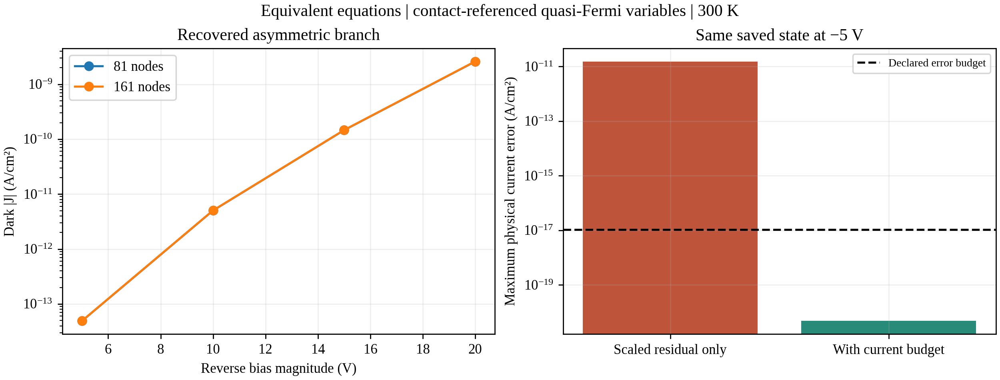

来源：90位原SG核验、对称回归及恢复曲线 [D2]；低温循环源扩展 [D7]

### 低温会把浮点相消伪装成产生通道

新低温率审计发现，即使采用稳定准费米电流，反应源本身的大项相减仍可失败。80 K、Dn/Dp=0.164/1.136 eV、−5 V时，旧计算给端流约−1.09×10⁻³⁰ A/cm²，独立完整对源却只有3.37×10⁻⁵² A/cm²，端流与对源之比约3.22×10²¹；旧电子净源2.17×10⁻³⁰与对源之比才是6.45×10²¹。这里没有率下溢；假源来自捕获与发射的舍入相消。

150 K同点误差仍约5.6万倍，到220 K约0.218%。这说明“绝对误差非常小”不能用来证明一个更小的净信号可靠。极微平均率本来只是数学压力测试，更不能因曲线平滑就当作可测低温电流。

修复保持相同物理率，用完整循环的正反乘积及expm1稳定表达式构造净源，并加独立相对物理预算。新双精度积分总源与110位逐事件相减相对差不超过1.85×10⁻¹⁶。16个主网格反偏、8个精确非零内建场平衡及4个细网格状态接受了限定验证。

但80 K空间网格变化仍为0.4–0.7%，经典率与固定迁移率没有低温材料标定。数值修复提高的是“给定方程被算对”的可信度，没有把那组经典方程变成77 K器件预测。

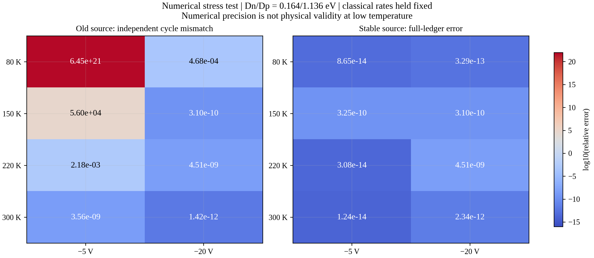

来源：循环净源、110位逐事件和相对门槛 [D7]

### 历史探索与本次新证据如何区分

在持续研究中，保留失败与局限和保留成功一样重要。本次可读取的原FF78工程保留了代码、参数和大量扫描；新的率、数值、量子及储库检查点又有独立冻结数据。它们可以支持正文明确限定的数值陈述。

另一些更早的有限状态图、归一谱展宽和固定跨度桥探索，在工作区恢复后只留下部分图像或讨论摘要。缺失完整代码、参数和原始数值时，不能因为图看起来合理，就把它写成今天已经复现的结果。本书保留其研究问题和方法约束，不从历史图片重新提取精确阈值或测试数量。

归一谱展宽的可靠一般认识是：它改变可用能量分布和峰形，但在固定总耦合下仍受核上界约束。固定带边桥的可靠研究原则是：缩短每步跨度必须与能量支持、返回及预算一起比较。新8态图和新有限带谱已重新建立这些问题的一部分，却不等于恢复了旧代码，也未完成真实空间桥的全部自洽闭合。

源包另保留四张确实找回的历史图及路径哈希，只供路线回顾。它们没有被混入本书重绘曲线或新统计。未来若重建这些方案，应给新的版本、参数和验证，不覆盖历史记录或让旧图冒充新结果。

来源：历史图单独归档；正文量化结论限于[D0]–[D7]中可核验的资料

### 默认参数下的数值比较

下表集中列出原FF78存档的默认比较点。厚度100 nm、环境300 K、规定光生尺度25 mA/cm²；电热反扫为2 V/s，其余按各自声明的稳态或缩约模型。各模型新增参数都是探索值，因此表格是条件结果，不是机制排名或实验拟合优度。

K50取80、100、120 nm三点拟合，截距自由。后续PF五厚度扫描的0.15296 V/nm属于另一个拟合区间，不应混入这一列。模型未跨阈值时留空；电热与经验支路的小负斜率接近零，来源包含数值提取和特定不随厚度变化的构成设定，不能解释成负击穿场。

局域全倍率的常规FF不适用，A到D详细结果已在前文说明。量子局部图没有完整器件输运和真实图密度，不应硬填FF或V50进入此表。真正有说服力的下一阶段比较，应使用同一组独立约束的材料参数，并预测没有参与校准的温度、厚度或接触条件。

| 模型 | FF % | Voc V | V50 V | K50 V/nm |
| --- | --- | --- | --- | --- |
| 局域SRH | 78.00 | 0.951 | 未达到 | — |
| 有限PF | 77.95 | 0.951 | −16.504 | 0.1581 |
| MA距离分布 | 75.48 | 0.940 | −18.724 | 0.1751 |
| 有效接触 | 77.97 | 0.951 | −17.288 | 0.1727 |
| 集总电热 | 77.15 | 0.942 | −11.742 | 约0 |
| 局部弱区 | 76.52 | 0.950 | −17.090 | 0.1594 |
| 经验支路 | 78.00 | 0.951 | −17.036 | 约0 |
| 弹性WKB微结 | 53.69 | 0.934 | −3.088 | 0.03056 |

来源：原comparison_metrics、K50_FF及tat_results；均为存档条件结果 [D0]

### 一张模型成绩单需要三个独立维度

这里不按“曲线像不像”给机制排座次。数学自洽、数值可靠和材料适用分别回答不同问题；一个模型可以前两项通过、第三项尚缺证据。也可以因为某个实现错误而失败，却不意味着整类物理机制被否定。

原有限距离PF目前最大的优点是可以在指定方程内形成持续配对源，且完整账本被重证；最大问题是双支吸引势与远程耦合。局域全倍率的失败则更多来自该闭合同时放大复合，不能代表所有PF。量子图把状态和浴显式化后解决了一些逻辑问题，却暴露储库谱与空间分离的新问题。

接触、电热、弱区和经验支路说明存在竞争解释，但不同层级无法直接横比数值优劣。独立TAT具有真实WKB积分，却仍缺体相带边和全器件电荷反馈。任何“最终机制”都还需要同一组受约束参数对多个独立观测负责。

| 模型 | 已经得到什么 | 仍不能据此宣称 |
| --- | --- | --- |
| 局域SRH | 平衡与基线正常 | 能解释反向膝点 |
| 局域A到D | 闭合消融与瓶颈 | 唯一微观PF实现 |
| 有限距离PF | 大体源和全账本重证 | 双支PF材料依据成立 |
| MA距离分布 | 距离代价与可逆跳跃 | 已测缺陷核 |
| Marcus及量子图 | 热核与占据显式化 | 目标77 K曲线 |
| 显式有限谱 | 发现端点复位瓶颈 | 材料电流上限 |
| 顺序WKB微结 | 弹性谱率与两端守恒 | 自洽体相TAT |
| 接触 热 弱区 | 具体竞争机制例子 | 已排除其它解释 |
| 经验支路 | 透明曲线描述 | 参数有唯一微观含义 |

来源：按本书实际完成范围汇总 [D0]–[D7]

## 第六部分 下一步与可检验预测

### 现阶段怎样设计有边界的理论比较

下一步应保持同一初末端点、总跨度与总耦合预算，比较不同的形成—转移—继续分离—返回—储库导出结构。每增加一个状态，都说明它代表什么电子态、在哪里、占据多少粒子、怎样改变化学势或库仑能，避免用任意中隙阶梯免费填平跨隙代价。

先不接器件时，局部图可输出容量、占据、返回比例、谱支持域和能量账本。再接Poisson–输运方程时，必须同时提供净电子/空穴源、图电荷或偶极、非局域跳跃电流，以及与局部n、p或准费米能级一致的储库条件。只把一个正向速率作为G(F)塞进去，会遗漏负反馈与平衡。

接受标准应在看曲线前确定：共同μ的有限场逐边零流；概率合法；循环亲和力正确；电荷和能量逐态守恒；单位与谱归一清楚；高精度与独立算法代表点一致；场/网格/积分范围公开；失败和未跨阈值不隐藏。

当某组有材料依据的参数仍不能给出足够容量，这是一个结果。应先查瓶颈属于形成、谱、回跳还是提取，再判断需要哪一项新的微观证据，而不是依次调λ、H、Nt直到上翘出现。

来源：从可逆率到自洽器件的闭合要求 [D1] [D3] [D4] [D6]

### 未来实验应该检验什么而不是先猜答案

用户希望先理解理论，再开展低温实验。这条顺序合理：当前许多决定性检查并不依赖新数据。下面列的是未来能够区分候选的观测逻辑，不是要求立刻执行的仪器操作或危险高压程序。

暗亮上翘近似重合应作为约束保留，同时比较绝对暗流、光电流差和光强依赖。只看阈值接近，既不能证明纯体源，也不能排除接触或热。必须确认同一像素、同一实际端压、相同温度与历史，而不是把不同文件标签凑成配对。

温度、厚度、时间和接触应联合考虑。某高场点的弱温度依赖可以来自量子侧带、占据窗饱和或其它过程；低温电流消失也可能来自提取而非产生。热边界与脉冲长度改变可约束电热，但台温稳定并不等于活性层无局部温升。

不可逆损伤需要独立判据，例如循环前后性能、持久漏电变化或空间变化，而不是把达到50 mA/cm²直接叫击穿。对高场试验，仪器限流、实际波形及数据时间序列是解释的一部分，应避免越过已授权和安全的实验范围。

| 要区分的因素 | 有信息量的联合观测 |
| --- | --- |
| 体源与接触供给 | 同像素暗亮幅值 接触条件 全通量账本 |
| 热PF与量子转移 | Eapp随场变化 恢复时间 跨温区形状 |
| 产生与提取 | 低温输运时间 占据或空间电荷 收集效率 |
| 恒温与电热 | 相同初态下时长 扫速 散热与实际温度 |
| 均匀体与弱区 | 面积统计 局部电流或热空间分布 |
| 可逆上翘与损伤 | 重复循环与测前测后不可逆变化 |

来源：理论判别逻辑 [D3]；样品约束与协议警示 [D5]

### 目前真正建立了哪些认识

第一，载流子来源必须与电流来源分开。一个陷阱发射一次电子不等于持续产生一对载流子；产生循环要回填，运输循环要有储库，全器件还要收集。这个要求不依赖选择PF、跳跃还是隧穿。

第二，原有限距离模型并非因电荷或能量不守恒而得到大电流。它在自己的端点假设中确有持续体对源，且新计算把通量、非局域电流与场功闭合。它的薄弱点是具体微观率与电荷态，而不是可以随意指认的“凭空造电子”。

第三，常规双支PF对普通整数电荷两态中心没有自动依据；只增强一支时慢支瓶颈极强。更复杂中心与场致转移仍可研究，但必须显式增加真实状态和形成路径，不能靠改名获得免费补给。

第四，低温量子振动可以推翻经典单核反转区的极端外推，但未必增加全部场域的电流。完整循环还可能被端点谱与束缚对复位限制。详细平衡决定比值，不能保证交换前因子真实。

第五，微小残差、漂亮曲线和大批测试数量都不能替代独立物理账本。已发现并修复的初猜阻尼、接触SG相消和反应假源，证明数值方法本身也需审查。修好数值之后，材料参数仍然未知。

因此，最有价值的下一步是继续建立受材料约束的可逆两步场致转移与跳跃输运模型，同时保留接触、电热和弱区竞争解释。现阶段不报告唯一真实机制，不给目标器件77 K击穿电压，也不因这些结论尚未确定而停止理论推进。

来源：总结范围：原FF78存档及本次新审计 [D0]–[D7]

## 附录 复算所需的定义

### 符号 单位与正负号速查

正文的电磁学推导采用q>0表示元电荷，电子电荷为−q；x从空穴端指向电子端，E=−∂xφ，常规电流与电子运动方向相反。器件J通常在反偏提取时为负，而局部图R取电子V→C为正，二者不能不加说明直接比较正负。

能量的SI公式应写qVbi=Eg−2Φc，或Δn=Dn−q[φe−φt]。源代码使用能量eV、电势V的数值约定：一个单位电子电荷跨1 V对应1 eV，所以数值式里q不再显写。这不是在量纲推导中把电荷删除。本书凡复述代码的无q端点式，都按这一数值约定理解。

物理电场方向与“有利场参数”也要区分。8态图采用φ=0.1F x，x用nm、F用MV/cm，于是电子向+x的势能下降；这里F是正的有利幅度，电场向量其实指向−x。不同图的符号应按图注明确。

| 符号或换算 | 定义 |
| --- | --- |
| 1 nm | 10⁻⁷ cm = 10⁻⁹ m |
| 1 MV/cm | 10⁸ V/m = 0.1 V/nm |
| 1 eV | 1.602176634×10⁻¹⁹ J |
| c 与 e | cm³/s 与 s⁻¹，不可互换 |
| Nt 与DOS幅度 | cm⁻³ 与 cm⁻³eV⁻¹ |
| Npath 与Ngraph | 完整通道/cm² 与独立图/cm³ |
| Jcap=qNgraphdR | 需均匀源 完全收集 独立图 |
| qNgraphLR | 内部有限跨度的位移贡献 |
| μch 与 μmob | 化学势 与 迁移率 |

来源：常数取元电荷精确定义及本书统一cm–s–V–A–eV约定

### 四接触与反应源应如何独立验算

若Jn、Jp按常规电流沿+x定义，电子左/右边界向外粒子通量分别为Jn(0)/q和−Jn(d)/q，空穴左/右则为−Jp(0)/q和Jp(d)/q。分别积分电子、空穴连续性，应把这四项与各自体源、复合及暂存电荷变化相连，不能只看一个端口值。

下式Rn、Rp定义为净陷阱损失率（捕获−发射），单位cm⁻³s⁻¹，与正产生Rpair符号相反。非局域反应在空间不同端点改变电荷，因此要对每条跳跃按跨越的网格面计算导电电流。此处“位移电流”指跃迁搬运电荷的电流，和Maxwell方程中的ε∂tE不是同一项。稳态中后者为零，前者却可以很重要。

独立检查还应避免与原实现共用同一错误。例如从原Rn、Rp再累计Jnl，只是内部回算；真正更强的检查是从占据与每条事件的端点位移重建，再与原结果比较。能量也可从逐事件状态能与储库功重建，而不是从已算出的J重复乘同一个场。

误差归一化必须合适。平衡净流为零时，相对误差以净值作分母会病态；远离平衡但净流极小时，仅给绝对容差又可能放过巨大相对假源。报告应同时包含绝对误差、gross尺度归一误差、独立净源预算和对用户关心的可观测量的影响。

$$
\Phi_{n,L}^{out}=J_n(0)/q,\quad\Phi_{n,R}^{out}=-J_n(d)/q
$$

$$
\Phi_{p,L}^{out}=-J_p(0)/q,\quad\Phi_{p,R}^{out}=J_p(d)/q
$$

$$
J_{\mathrm{nl}}(x)=-q\int_0^x[R_n(s)-R_p(s)]\,ds
$$

来源：逐事件与四接触独立重构 [D1]；稳定源与预算 [D2] [D7]

## 附录 理论与材料来源

### 主要原始文献之一

以下为正文使用的一手研究与原始理论。引用它们用于限定的公式、物理前提或材料表征，不意味着这些论文已经验证本用户器件。所有链接与DOI在可编辑源包中保留。

[R1] Shockley W, Read W T. Statistics of the Recombinations of Holes and Electrons. Physical Review 87, 835–842 (1952). DOI 10.1103/PhysRev.87.835。用于四过程统计框架；本文的占据消元独立推导。

[R2] Mitrofanov O, Manfra M. Poole–Frenkel electron emission from traps in AlGaN/GaN transistors. Journal of Applied Physics 95, 6414 (2004). DOI 10.1063/1.1719264。用于电子逃逸后正电核心、吸引库仑势与不同逃逸机制前提；不移植GaN参数。

[R3] Marcus R A. On the Theory of Oxidation-Reduction Reactions Involving Electron Transfer I. Journal of Chemical Physics 24, 966 (1956). DOI 10.1063/1.1742723。用于经典重组自由能背景。

[R4] Miller A, Abrahams E. Impurity Conduction at Low Concentrations. Physical Review 120, 745 (1960). DOI 10.1103/PhysRev.120.745。用于声子辅助局域跳跃框架。

[R5] Pasveer W F et al. Unified Description of Charge-Carrier Mobilities in Disordered Semiconducting Polymers. Physical Review Letters 94, 206601 (2005). DOI 10.1103/PhysRevLett.94.206601。用于占据、温度、密度与电场耦合的跳跃输运。

[R6] Vukmirović N, Wang L-W. Carrier hopping in disordered semiconducting polymers: How accurate is the Miller–Abrahams model? arXiv:1005.1964 (2010)。用于P3HT微观反例；不当作D18参数。

[R7] Heller E R, Richardson J O. Semiclassical instanton formulation of Marcus–Levich–Jortner theory. Journal of Chemical Physics (2020). DOI 10.1063/5.0013521；arXiv:2005.05860。用于一般热Franck–Condon双和及低温近似边界。

[R8] Braig S, Flensberg K. Vibrational sidebands and dissipative tunneling in molecular transistors. Physical Review B 68, 205324 (2003). DOI 10.1103/PhysRevB.68.205324；arXiv:cond-mat/0303236。用于有限温度侧带，不作为OSC缺陷参数。

[R9a] Ganichev S D, Yassievich I N, Prettl W. Tunnel ionization of deep impurities by far-infrared radiation. Semiconductor Science and Technology 11, 679–691 (1996). DOI 10.1088/0268-1242/11/5/006。

[R9b] Ganichev S D. Tunnel ionization of deep impurities in semiconductors induced by terahertz electric fields. Physica B 273–274, 737–742 (1999). DOI 10.1016/S0921-4526(99)00637-7。用于声子辅助深中心过程，未移植其材料参数。

[R10] Jortner J. Temperature dependent activation energy for electron transfer between biological molecules. Journal of Chemical Physics 64, 4860–4867 (1976). DOI 10.1063/1.432142。用于低温多声子与经典高斯近似的差别。

来源：开放原文地址及实际核对范围见source_ledger与source_manifest

### 主要原始文献之二

[R11] Liu Q et al. 18% Efficiency organic solar cells. Science Bulletin 65, 272–275 (2020). DOI 10.1016/j.scib.2020.01.001。D18原始CV与光学表征；原器件配Y6。

[R12] Li C et al. Non-fullerene acceptors with branched side chains and improved molecular packing to exceed 18% efficiency in organic solar cells. Nature Energy 6, 605–613 (2021). DOI 10.1038/s41560-021-00820-x。L8-BO原始能级与SI Fig7单晶ZINDO耦合。

[R13] Yao J et al. Cathode engineering with perylene-diimide interlayer enabling over 17% efficiency single-junction organic solar cells. Nature Communications (2020). DOI 10.1038/s41467-020-16509-w。PDINN及修饰电极功函数；原活性层为PM6:Y6。

[R14] Dela Peña T A et al. Tailoring short-range mobility at donor–acceptor heterointerfaces through small molecules promotes efficient organic solar cells. Energy & Environmental Science 18, 10164–10179 (2025). DOI 10.1039/D5EE05342K。CT光谱分解和异质界面语境；本书没有采用无法可靠读取的图中λ数字。

[R15] Wu L et al. A donor-acceptor integrated polymer for efficient organic solar cells. Science Advances 12, eaec1922 (2026). DOI 10.1126/sciadv.aec1922。正文Table1与PESA/IPES口径。

[R16] Gao W et al. Interchain supramolecular interactions drive nearly 21% efficiency organic solar cells. Nature Communications 17, 4590 (2026). DOI 10.1038/s41467-026-71199-0。UPS与CV推算能级的区别。

[R17] Zhu L et al. Single-junction organic solar cells with over 19% efficiency enabled by a refined double-fibril network morphology. Nature Materials (2022). DOI 10.1038/s41563-022-01244-y。正式SI的1:1.2 D18:L8-BO DD-SCLC、C–f陷阱与IS无序度。

[R18] Ortner B C et al. Donor dilution in D18:L8-BO organic solar cells: visualization of morphology and effects on device characteristics. Journal of Materials Chemistry C (2025). DOI 10.1039/D5TC02251G。Table1的输运失衡分支。

[R19] Molecular interaction regulation by adding a third component with high miscibility suppresses the energetic disorder and reduces energy loss for efficient ternary solar cells. Journal of Materials Chemistry C (2024). DOI 10.1039/D4TC03741C。仅采用binary控制组、SI TableS3及光学Urbach值。

[R20] High performance organic solar cell enabled by manipulating the exciton dissociation and charge transfer via dielectric engineering. Nature Communications (2026). DOI 10.1038/s41467-026-74112-x。介电控制组及DOS；保留表格比值与单位歧义。

来源：只列实际使用的主来源；材料处理条件详见[D5]23行证据矩阵

## 附录 数据和可编辑源包

### 计算资料与复现边界

[D0] 原OSC_FF_reverse_knee_model工程及results_ff78：共同基准，局域SRH，A到D四速率，有限PF，MA距离分布，接触、电热、弱区、经验支路，独立TAT，以及密度与厚度存档扫描。本书读取源码、报告和数据，不声称本次全部重新计算。

[D1] revalidated_rate_audit_20261002：有限距离模型新解、分支消融、四接触、源循环、非局域电流及场功的独立检查。

[D2] asymmetric_solver_diagnostics_20261002：不对称陷阱的续接初猜、log-Newton阻尼、准费米SG与微小端流预算。

[D3] temperature_mechanism_audit_20261002：80–330 K核、PF供应界、量子侧带、连续谱、固定μ/固定n及提取尺度。

[D4] quantum_cycle_audit_20261002：新3位点8态可逆图、10818稳态点、有限交换、库仑提取反馈及错误核反例。

[D5] d18_l8bo_constraints_20261002：材料证据矩阵与带空值参数卡。没有将同材料文献升级成目标样品测量。

[D6] quantum_reservoir_audit_20261002：显式单侧带谱、匹配耦合、21636稳态点、谱支持控制与声子/电子库热分配。

[D7] qf_temperature_confidence_20261002：80–300 K经典数学模型的反应相消、稳定循环源、110位核验与物理预算。

可编辑源包包含全文内容脚本、PDF排版与原创图脚本、采用图像、机器可读数据摘录、原文件路径及SHA-256清单。报告和图引用的是冻结副本；完整研究检查点另有独立备份。部分历史有限图、谱展宽和固定桥探索只剩旧图，未重建完整代码，因此未用作本书新数值证据。

复现本书排版不等于复现全部物理扫描。正文把这两种复现分别命名，避免一键生成PDF被误解为所有结论均重新运行。科学结论应随新材料证据和后续自洽器件计算更新。

来源：源包根目录README与data/source_manifest.json；最终版本信息和逐页QA见QA记录